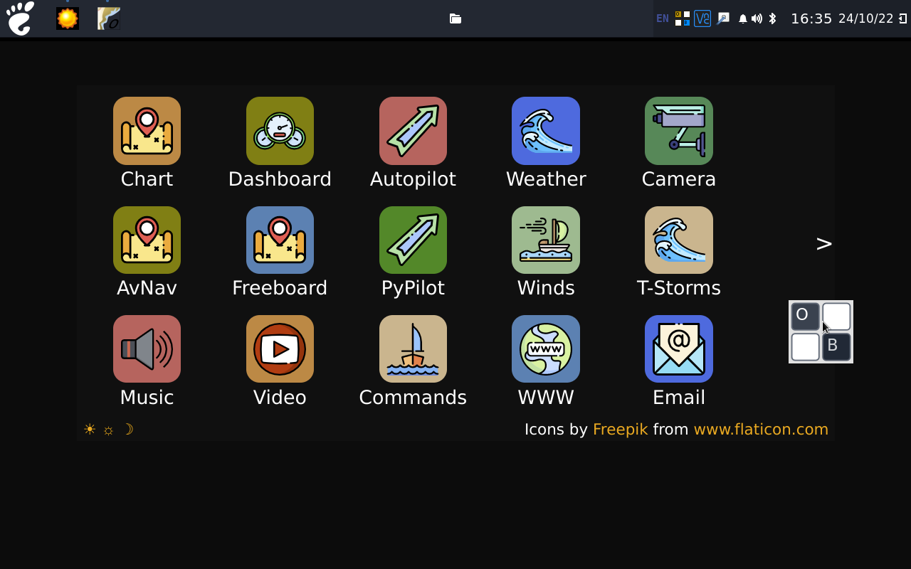
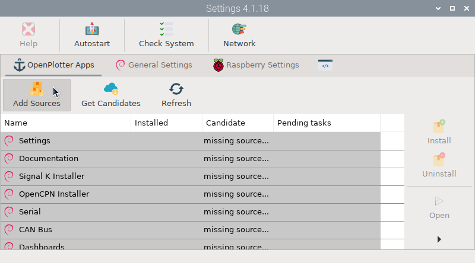

지난번 소개드린 **[OpenPlotter 설치 완전입문]()**, 잘 사용하고 계신가요? 이제 어느 정도 익숙해지셨다면 오늘은 그 대항마로 자주 거론되는 **BBN OS** 도 소개드리려 합니다.

라즈베리파이 차트플로터를 만지기 시작하면 대부분은 OpenPlotter부터 접하게 됩니다. 저 역시 그 흐름으로 구조를 익혔고, Signal K를 중심으로 이것저것 붙이며 꽤 오래 써봤습니다. 그러다 어느 순간 "좀 더 완성형에 가까운 요트 오픈소스 플로터는 없을까?" 싶을 때 눈에 들어온 게 BBN OS, 정확히는 BBN Marine OS 계열이었습니다.

짧게 먼저 말씀드리면 이렇습니다. **OpenPlotter는 필요한 기능을 하나씩 붙여가는 모듈식 배포판**에 가깝고, **BBN OS는 처음부터 여러 앱이 꽉 차 있는 완성형 배포판**에 가깝습니다. 다만 "처음 화면이 예쁘다"와 "설정까지 끝까지 편하다"는 전혀 다른 이야기였습니다.
화면구성은 OpenPlotter는 윈도우에 가깝고, BBN OS는 안드로이드 태블릿에 가깝습니다.

## 짧은 결론부터

처음 라즈베리파이 차트플로터를 배우는 분, 구조를 이해하면서 Signal K 연결 감을 익히고 싶은 분에게는 저는 여전히 OpenPlotter를 권합니다. 반대로 OpenCPN, PyPilot, 대시보드류가 어느 정도 갖춰진 화면에서 바로 시작하고 싶고, 터치 친화적인 UI를 선호한다면 BBN OS를 한 번 시험해볼 가치는 충분합니다. 제 체감으로는 **OpenPlotter는 배우기 좋은 쪽**, **BBN OS는 보기 좋은 쪽** 이었습니다.

## BBN OS가 눈에 띄는 이유

BBN OS 공식 문서는 이 프로젝트를 OpenPlotter 경험에서 출발한 중앙 보트 컴퓨터로 설명하고, Signal K, OpenCPN, PyPilot 같은 구성요소와 터치 친화적인 GUI를 전면에 둡니다. 실제로 켜보면 왜 그렇게 소개하는지 바로 이해가 됩니다.

무엇보다 첫 화면이 꽤 좋습니다. 아이콘이 정돈돼 있고 런처가 태블릿처럼 보여서, "이건 그냥 리눅스가 아니라 선박용으로 잘 다듬은 화면이구나" 하는 인상을 줍니다. 기본 앱도 충실한 편이라 설치 직후부터 차트, 대시보드, 오토파일럿, 날씨 쪽까지 한 덩어리로 잡혀 있는 느낌이 강합니다.

공식 비교 페이지에서도 BBN 쪽은 터치 사용성과 올인원 성격을 강점으로 밀고 있습니다. 다만 이건 어디까지나 BBN 측의 자기 설명입니다. 첫인상은 분명 좋지만, 실제 평가는 설정 단계까지 들어가 봐야 공정합니다.

*▲ BBN OS는 첫 화면부터 태블릿 같은 런처 구조를 보여줘 진입 경험이 꽤 좋습니다.*

> **Captain's Note:** "처음 켰을 때 '오, 이건 좀 태블릿 같은데?'라는 느낌은 BBN OS 쪽이 더 강했습니다."

## 실제 써보니 어려웠던 점

여기서부터는 실사용 후기입니다. BBN OS는 아이콘과 런처가 보기 좋고 기본 앱이 충실해서 분명 완성형처럼 보입니다. 그런데 막상 설정으로 들어가면, OpenPlotter보다 더 쉽게 흘러간다고 말하기는 어렵습니다.

특히 Signal K 연결이나 서비스 간 엮임을 손볼 때는 생각보다 터미널 직접 입력이 필요했습니다. 겉으로는 편해 보여도, 막히는 순간 명령어로 들어가는 체감이 있었고 이게 초반 진입장벽으로 느껴졌습니다. 제 배 환경에서는 "예쁘고 편해 보이지만, 깊이 들어가면 쉬운 것만은 아니다" 쪽이 더 정확했습니다.

이 지점에서 OpenPlotter의 장점이 다시 보입니다. OpenPlotter 공식 문서는 Raspberry Pi에 최적화돼 있지만 Debian/Ubuntu 계열에도 설치할 수 있게 안내하고, `Settings`, `Signal K Installer`, `Signal K connection` 같은 흐름을 모듈 단위로 끊어 설명합니다. 그래서 투박해 보여도 "이건 여기서 켜고, 저건 저기서 연결한다"는 감을 잡기가 좋습니다.

*▲ OpenPlotter는 Settings 앱을 중심으로 필요한 기능을 차근차근 붙여가는 방식이 익숙합니다.*

> **Captain's Tip:** "예쁘고 완성형처럼 보여도, 배 위 컴퓨터는 결국 내가 다뤄야 할 시스템입니다. 설정이 눈에 잘 보이는 것과 실제로 쉬운 것은 다를 수 있습니다. 하지만 이제 우리에게는 터미널 명령어도 잘알려주는 AI가 있으니 걱정없습니다."

## OpenPlotter와 BBN OS 비교표

| 항목 | OpenPlotter | BBN OS |
| --- | --- | --- |
| 첫인상/UI | Settings 중심, 작업대 느낌 | 런처형, 태블릿 느낌 |
| 설치 후 기본 구성 | 필요한 앱을 골라 붙이는 편 | 기본 앱이 많고 올인원 느낌 |
| 설정 난이도 | 흐름이 보여 익숙해지기 좋음 | 막히는 지점에서 터미널 개입 체감 |
| Signal K 연결 체감 | Installer와 connection 흐름이 선명 | 연결은 되지만 손으로 만질 때가 있음 |
| 터치 친화성 | 무난한 편 | 더 직관적이고 터치 친화적 |
| 확장성/커뮤니티 문서 | 문서와 사례가 풍부 | 공식 문서와 GitHub 중심 |
| 추천 사용자 | 구조를 이해하며 세팅하고 싶은 분 | 완성형 시작점을 원하는 분 |

표로 보면 단순합니다. **OpenPlotter는 모듈식**, **BBN OS는 완성형** 입니다. 어느 쪽이 무조건 더 낫다기보다, 어느 방식이 내 성향과 배선 환경에 더 맞느냐가 핵심입니다.

## 누구에게 더 맞을까?

### OpenPlotter를 추천하는 경우

- 처음 해양용 라즈베리파이 시스템을 배우는 분
- Signal K 구조를 이해하며 하나씩 붙이고 싶은 분
- 나중에 센서, 데이터, 자동화를 많이 커스텀할 계획이 있는 분
- 문서와 GUI 흐름이 나뉘어 있는 편이 더 편한 분

### BBN OS를 추천하는 경우

- 처음 켰을 때 완성형 느낌이 중요한 분
- 런처형 화면과 터치 중심 조작을 선호하는 분
- OpenCPN, Signal K, PyPilot 계열을 한 화면 안에서 빨리 써보고 싶은 분
- 세팅 난이도보다 "출발점이 보기 좋게 갖춰져 있는 것"이 더 중요한 분

제 개인적인 결론은 이렇습니다. **OpenPlotter로 기본기를 먼저 익히고**, 그다음 다른 완성형 대안을 찾을 때 BBN OS를 비교해보면 장단점이 훨씬 또렷하게 보입니다.

## 다운로드 링크

- [OpenPlotter 공식 다운로드/문서](https://openplotter.readthedocs.io/latest/getting_started/downloading.html)
- [OpenPlotter 공식 소개](https://openmarine.net/openplotter)
- [BBN OS 공식 문서](https://bareboat-necessities.github.io/my-bareboat/bareboat-os.html)
- [BBN OS 공식 GitHub 릴리스/프로젝트](https://github.com/bareboat-necessities/lysmarine_gen)

## FAQ

### OpenPlotter와 BBN OS 중 초보자에게 더 쉬운 쪽은 무엇인가요?

초보자라면 저는 OpenPlotter 쪽에 한 표를 줍니다. 첫 화면의 세련됨은 BBN OS가 앞서지만, 구조를 익히고 문제를 해결하는 흐름은 OpenPlotter가 더 잘 보이는 편입니다.

### BBN OS는 정말 OpenPlotter보다 편한가요?

첫인상과 앱 구성은 BBN OS가 더 편하게 느껴질 수 있습니다. 다만 Signal K 연동이나 세부 설정 단계까지 포함하면 꼭 그렇지만은 않습니다. 보기 좋은 것과 끝까지 다루기 쉬운 것은 다를 수 있습니다.

### Signal K 연동은 어떤 쪽이 더 쉬운가요?

제 체감으로는 OpenPlotter가 더 익숙했습니다. OpenPlotter는 Settings와 Installer 흐름이 보여서 어디를 만지는지 감이 잡히는데, BBN OS는 막히는 순간 터미널로 넘어가는 느낌이 더 빨랐습니다.

### Raspberry Pi 차트플로터를 처음 만든다면 무엇부터 시작하는 게 좋나요?

처음이라면 OpenPlotter로 구조를 익히는 쪽을 권합니다. 그다음 BBN OS를 깔아보면 왜 한쪽은 모듈식이고 다른 쪽은 완성형으로 느껴지는지 훨씬 선명하게 비교됩니다.

정리하면, BBN OS는 분명 매력적인 대안입니다. 다만 OpenPlotter를 대체한다기보다, 다른 방향의 해양용 라즈베리파이 배포판으로 보는 편이 실제 체감과 더 가깝습니다.

**Bon Voyage!**

### 📚 함께 읽으면 좋은 글

- **[상용 플로터를 넘어서: OpenPlotter와 MacArthur HAT으로 나만의 통합 항해 시스템 만들기]()**: OpenPlotter 확장 관점에서 전체 그림을 잡기 좋습니다.
- **[4만원으로 요트 전력 관리 시스템 구축하기: KM110F 데이터 연동 & OpenPlotter 통합]()**: Signal K 기반 DIY 통합 사례를 함께 보면 차이가 더 잘 보입니다.
