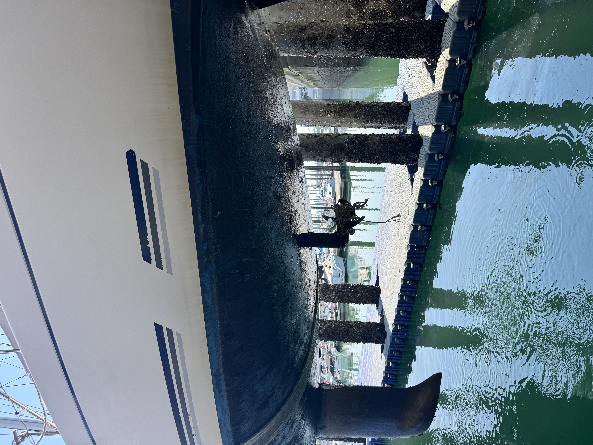

오랜만에 글을 올립니다.

그 사이 홈페이지도 조금 손봤고, 배도 계속 손보고 있습니다. 화성 뱃놀이 축제 참여 준비를 하면서 예약 안내와 홈페이지 문구를 정리했고, 비미니도 새로 설치했습니다. 토레일 쪽에는 실러를 다시 발랐습니다. 바닷물과 햇빛을 계속 맞는 배는, 손을 놓는 순간 바로 티가 납니다.

손님들을 모시고 제부도 앞바다에 나간 날도 있었고, 바람 때문에 일정을 조정한 날도 있었습니다. 지난주 금요일 선셋투어에서는 저도 방심한 순간이 있었습니다. 익숙한 구간이라고 생각하며 지나가다 통발 로프가 세일드라이브에 걸렸고, 급하게 정리해야 했습니다.

<figure class="lead-visual align-center">
  
  <figcaption>익숙한 앞바다에서도 통발 로프 하나가 운항을 바로 멈춰 세울 수 있습니다.</figcaption>
</figure>

이 글은 사실 지난주에 초안 작성이 끝났습니다. 그런데 어제는 친구가 또 비슷한 사고를 쳤습니다. 절대로 친구를 저격하는 글은 아닙니다. 다만 바다는 사람을 가리지 않고, 방심도 경력순으로 봐주지 않는다는 생각이 다시 들었습니다.

바다는 늘 비슷해 보이지만, 실제로는 매번 다릅니다.

이번 글은 요트 안전 운항에서 자주 보이는 한 가지 착각에 대한 이야기입니다. 바로 **"자주 다니는 바다니까 잘 안다"** 는 생각입니다.

동네 앞바다를 오래 다닌 경험은 분명히 중요합니다. 어느 시간에 물이 세게 흐르는지, 어느 방향 바람이 접안을 어렵게 만드는지, 손님들이 어느 구간에서 불안해하는지 같은 감각은 책으로만 얻기 어렵습니다.

하지만 그 경험이 해도, 조석, 조류, 기상, 항해학을 대신하기 시작하면 이야기가 달라집니다. 익숙함은 도움이 될 수 있지만, 익숙함 자체가 안전을 보장하지는 않습니다.

## 익숙한 바다가 더 위험해질 때

처음 가는 바다는 누구나 조심합니다.

해도를 다시 보고, 수심을 확인하고, 항로표지를 챙겨 보고, 바람과 조류를 한 번 더 봅니다. 낯선 항구에 들어갈 때는 속도를 줄이고, 주변을 살피고, 여유 공간을 크게 잡습니다.

문제는 자주 다니는 바다입니다.

늘 지나가던 항로, 늘 보던 부표, 늘 접안하던 선석. 이런 것들이 쌓이면 어느 순간부터 확인보다 기억으로 운항하게 됩니다.

> 어제도 괜찮았으니까.
>
> 여기는 내가 많이 다녀봤으니까.
>
> 이 정도 바람은 늘 있던 거니까.

이런 생각이 사고의 시작점이 될 수 있습니다.

바다는 같은 장소라도 시간에 따라 달라집니다. 조석이 바뀌면 수심이 바뀌고, 조류가 바뀌면 선체가 받는 힘이 달라집니다. 바람 방향이 조금만 틀어져도 이안과 접안의 난이도가 달라집니다.

동네 앞바다라서 쉬운 것이 아닙니다. 자주 다녀서 안전한 것도 아닙니다. 오히려 자주 다니기 때문에 확인을 생략하기 쉽고, 그 생략이 위험해질 수 있습니다.

## 인지부조화는 선장을 방어적으로 만듭니다

인지부조화라는 말이 있습니다.

쉽게 말하면, 내가 믿고 있던 생각과 실제 현실이 맞지 않을 때 생기는 불편함입니다. 항해에서도 이 현상은 자주 보입니다.

**스스로를 경험 많은 사람이라고 생각하는데, 누군가 해도, 조류, 항해계획, 기상 판단을 이야기하면 불편해지는 경우가 있습니다. 그 내용을 잘 알고 있어서 반박하는 것이 아니라, 사실은 잘 모르기 때문에 더 불편해지는 경우도 있습니다.**

이때 사람은 보통 두 방향으로 갑니다.

하나는 배우는 쪽입니다.

> 내가 이 부분은 놓쳤구나.
>
> 다시 확인해 봐야겠다.
>
> 경험만으로 판단하면 안 되겠구나.

다른 하나는 방어하는 쪽입니다.

> 책으로 배운 사람이 현장을 아나.
>
> 여기는 내가 제일 잘 안다.
>
> 그런 건 큰 배나 먼바다 이야기다.

문제는 두 번째입니다.

마리나에서도 가끔 비슷한 장면을 봅니다. 배를 자주 타는 것도 아니고, 도장기술, 선박 운용과 정비의 기본을 깊게 쌓은 것도 아닌데 이상한 근거 없는 자신감에 빠지는 경우가 있습니다. 다른 선주들의 판단은 쉽게 깎아내리고 뒤에서 욕하면서, 정작 본인이 사고를 치면 바람 탓, 장비 탓, 주변 사람 탓으로 돌립니다.

이것도 결국 인지부조화에 가깝습니다. 내가 알고 있다고 믿는 나와, 실제로는 모르는 부분이 많은 나 사이의 간격을 인정하지 못하니 방어적으로 변하는 겁니다.

바다는 이런 방어 논리를 봐주지 않습니다. 바람은 경력증명서를 확인하지 않고, 조류는 자존심을 봐주지 않습니다. 암초와 얕은 수심은 "동네 사람이니까 괜찮다"고 피해 가지 않습니다.

위험한 것은 모르는 것 자체보다, 모른다는 사실을 인정하지 못하는 태도입니다.

## 해도를 보지 못하면 판단의 기준이 약해집니다

요트든 낚싯배든 레저보트든, 배를 운항하는 사람이라면 해도는 볼 줄 알아야 합니다.

해도에는 수심만 적혀 있는 것이 아닙니다. 간출암, 암초, 등심선, 항로, 항로표지, 제한구역, 저질, 위험구역이 함께 들어 있습니다.

전자해도와 GPS가 좋아졌다고 해서 이 기본이 사라지는 것은 아닙니다. 오히려 장비가 좋아질수록 사용자가 무엇을 보고 있는지 더 잘 알아야 합니다.

GPS는 현재 위치를 알려줍니다. 하지만 그 위치가 안전한지는 선장이 판단해야 합니다.

전자해도는 화면에 항로를 그려 줍니다. 하지만 그 항로가 지금의 조석, 조류, 바람, 드라프트, 승객 상태에 맞는지는 선장이 판단해야 합니다.

장비는 도구입니다. 판단은 사람의 몫입니다.

해도를 보지 못하면 "왜 이쪽으로 가야 하는지"를 설명하기 어렵습니다. 예전에 다녔던 길이라서, 남들이 다니는 길이라서, 앱 화면에서 선이 그어지기 때문에 가는 것은 안전한 항해계획이 아닙니다.

안전한 판단은 설명 가능해야 합니다.

## 항해학은 먼바다에만 필요한 것이 아닙니다

항해학이라는 말을 하면 거창하게 느끼는 분들도 있습니다.

대양항해, 상선, 원양항해에나 필요한 이야기처럼 생각하기 쉽습니다. 하지만 앞바다를 다니는 작은 배일수록 기본 원칙이 더 중요할 때가 많습니다.



작은 배는 바람에 더 민감합니다.

작은 배는 조류에 더 쉽게 밀립니다.

작은 배는 파고와 너울에 더 직접적으로 반응합니다.

작은 배는 여유수심과 접안 공간이 부족할 때 선택지가 적습니다.

그래서 앞바다일수록 더 단단한 기본이 필요합니다.

조석을 모르고 수심을 판단하면 안 됩니다. 조류를 모르고 항로를 잡으면 안 됩니다. 풍향과 풍속을 보지 않고 출항 여부를 결정하면 안 됩니다. 해도를 보지 않고 경험만으로 코스를 잡으면 안 됩니다.

항해학은 시험을 보기 위한 지식이 아닙니다. 현장에서 실수를 줄이기 위한 언어에 가깝습니다.

## 경험은 공부와 만나야 실력이 됩니다

현장 경험은 중요합니다.

바람이 어느 산을 넘어오면 갑자기 세지는지, 어느 선석에서 횡풍을 더 받는지, 제부도 앞바다에서 어느 시간대에 손님들이 더 편안해하는지 같은 것은 실제로 다녀 본 사람이 더 잘 알 수 있습니다.

하지만 경험만으로 충분하다고 생각하는 순간, 경험은 오히려 위험해질 수 있습니다.

경험은 공부와 만나야 실력이 됩니다.

해도를 보고, 수심을 읽고, 조석을 확인하고, 조류를 생각하고, 기상을 해석하고, 내 배의 한계를 알아야 합니다. 오늘 나가도 되는지, 어디까지 갈 수 있는지, 언제 돌아와야 하는지, 손님을 태우는 것이 맞는지 설명할 수 있어야 합니다.

"늘 다니던 곳이라 괜찮다"는 말은 선장의 답이 아닙니다.

괜찮다면 왜 괜찮은지 설명할 수 있어야 합니다. 위험하다면 무엇이 위험한지 설명할 수 있어야 합니다. 나가지 않는다면 왜 나가지 않는지 설명할 수 있어야 합니다.

이 설명이 가능해질 때, 경험은 감이 아니라 판단이 됩니다.

## 선장은 키를 잡는 사람이 아니라 판단하는 사람입니다

배를 모는 일은 단순히 키를 잡는 일이 아닙니다.

키는 조타수가 잡습니다. 선장은 판단하는 사람입니다. 조타수 능력만 가지고 있으면서 본인을 선장으로 아는 사람들이 있습니다.

선장은 계속 판단합니다.

오늘 나갈 것인가. 지금 돌아올 것인가. 어느 코스를 택할 것인가. 접안을 한 번에 시도할 것인가, 다시 돌 것인가. 손님에게 일정을 조정하자고 말할 것인가. 바람이 더 오르기 전에 멈출 것인가.

이 판단 하나하나가 안전을 만듭니다.

좋은 선장은 배를 과감하게 모는 사람이 아닙니다. 좋은 선장은 멈춰야 할 때 멈출 줄 아는 사람입니다.

자주 다니는 바다일수록 더 확인해야 합니다. 익숙한 코스일수록 더 의심해야 합니다. 예전에 괜찮았던 조건일수록 오늘도 같은지 다시 봐야 합니다.

## 결국 공부해야 합니다

배를 운항하는 사람이라면 공부해야 합니다.

해도를 봐야 합니다. 조석을 이해해야 합니다. 조류를 생각해야 합니다. 풍향과 풍속을 읽어야 합니다. 항로표지를 알아야 합니다. 내 배의 드라프트와 조종 특성을 알아야 합니다.

그리고 무엇보다, 모르는 것을 모른다고 인정할 수 있어야 합니다.

초보자는 대체로 조심합니다. 묻고, 확인하고, 천천히 움직입니다. 오히려 위험한 경우는 조금 익숙해진 뒤입니다. 그때부터 확인이 줄고, 질문이 줄고, 공부가 줄어듭니다.

바다는 그 빈틈을 놓치지 않습니다.

마이요트는 제부도 앞바다를 운항할 때도 매번 바람, 물때, 시정, 파고, 접안 조건을 확인합니다. 같은 코스를 반복해도 같은 바다는 아니기 때문입니다.

선장은 매일 배워야 합니다. 바다는 매일 다른 문제를 냅니다.

그래서 오늘도 다시 봅니다.

해도를 보고, 바람을 보고, 물때를 보고, 바다를 봅니다.

그게 선장의 일입니다.

## 함께 보면 좋은 글

* **[해도의 기본수준면(Chart Datum): 1급 해기사가 알려주는 안전 수심 독해법]()**: 해도에 적힌 수심 숫자가 어떤 기준으로 표시되는지 정리한 글입니다.
* **[해도의 수심정보 판독법: 숫자 없는 구간을 함부로 읽으면 위험한 이유]()**: 숫자 없는 구간을 감으로 읽으면 왜 위험한지 함께 볼 수 있습니다.
* **[제부도 요트 항해 계획(Passage Planning): 1급 해기사의 실무 노하우]()**: 수심, 물때, 바람을 실제 출항 계획에 어떻게 연결하는지 정리한 글입니다.

**Bon Voyage!**
