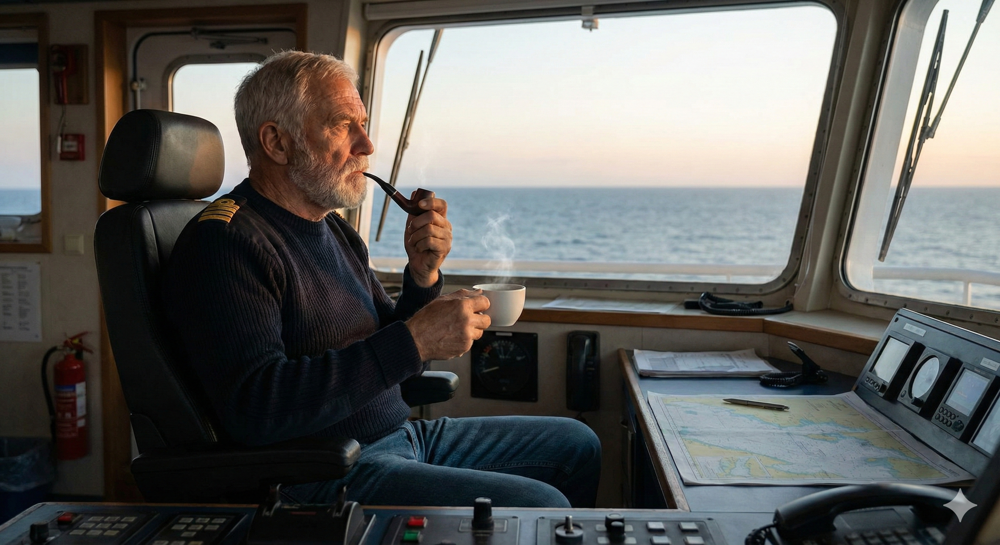
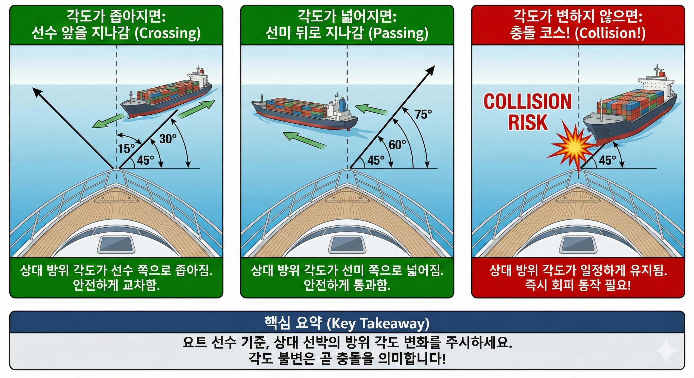

영화나 드라마를 보면 선장들이 조타실(Bridge) 의자에 비스듬히 앉아 여유롭게 커피를 마시거나 파이프 담배를 즐기는 모습을 자주 보셨을 거예요.

겉으로 보기엔 참 편안해 보이죠? "항해사들이 바쁘게 움직이는데 선장은 앉아서 놀고 있네?"라고 생각하실 수도 있어요. 하지만 여기에는 **베테랑 선장들만이 아는 소름 돋는 '안전 항해'의 비밀**이 숨겨져 있답니다.

---

## 1. "선장님, 어떻게 그렇게 빨리 찾으세요?"

저도 항해사 시절엔 늘 의문이었어요. 저는 레이더를 뚫어지게 쳐다보고 조타실을 왔다 갔다 하며 바쁘게 움직여도 못 찾은 수평선의 작은 배나 기상 변화를, 의자에 가만히 앉아 있던 선장님은 귀신같이 찾아내셨거든요.

처음엔 단순히 '짬밥', 즉 경력의 차이인 줄만 알았습니다. 하지만 제가 직접 선장이 되어 거대한 상선의 선교에서 수십만 톤급 배를 책임지다 보니 깨닫게 된 진실이 있었습니다.

---

## 2. 움직이지 않는 자의 시선: 방위(Bearing)의 비밀

선장이 의자라는 **'고정된 위치'**를 고수하는 이유는 바로 **상대 선박의 미세한 방위(Bearing) 변화**를 감지하기 위해서예요.

원리는 간단하지만 강력합니다.

* 내가 이리저리 움직이면 배경(수평선, 섬 등)도 같이 움직여서 **착시**가 생겨요.
* 하지만 고정된 자리에 앉아 조타실 창틀이나 와이퍼 같은 특정 지점을 기준점 삼아 상대 선박을 바라보면, 그 배가 옆으로 움직이는지 내 쪽으로 오는지 명확히 보입니다.

여기서 항해의 대원칙이 나옵니다.
> **"상대 방위(Bearing)가 변하지 않는데 거리가 가까워진다? 100% 충돌 코스입니다."**

이것을 전문 용어로 **'나침반 방위의 불변(Compass Bearing is not changing)'**이라고 합니다. 항해사들이 복잡한 레이더(ARPA)를 조작해서 계산하는 것보다, 의자에 앉은 선장의 눈이 훨씬 직관적이고 빠를 때가 많죠. 이것이 바로 선장이 의자에 앉아 있는 진짜 이유, 즉 **충돌 방지**를 위한 고도의 기술입니다.

위 그림처럼 상대 배의 각도가 선박 쪽으로 좁아지거나 멀어지면 안전하게 교차하지만, **각도가 변하지 않으면 충돌 코스**라는 점을 꼭 기억해야 합니다.

---

## 3. 요트 항해에 적용하는 꿀팁

우리 **마이요트** 가족분들도 요트 항해를 하실 때 이 원리를 적용해 보세요.

장거리 항해 시 조타석에서 이리저리 왔다 갔다 하지 마세요. **가장 견시(Look-out)하기 좋은 자리를 딱 정해서 엉덩이를 붙이세요.** 그리고 상대방 배가 내 배의 특정 구조물(스테이, 마스트 등)을 기준으로 방위가 변하는지 주시하는 겁니다.

만약 상대 배가 계속 똑같은 자리에 머물면서 크기만 커진다면? **당장 피항 동작을 준비해야 하는 위험 신호**입니다.

---

## 4. 안전이 곧 럭셔리입니다

저 캡틴 리마가 운영하는 **제부도 요트 투어**가 단순히 예쁜 사진만 찍는 곳이 아닌 이유가 여기에 있습니다.

저는 항해의 기본 원칙을 가장 중요하게 생각합니다. 1급 해기사 선장의 눈으로 매 순간 수평선을 주시하며, 가장 안전한 환경에서 여러분께 서해안 낙조의 감동을 선사하고 있죠.

여러분도 바다에 나오시면 '선장의 의자'에 앉아보세요. 게으름이 아닌, 바다와 대화하며 안전을 설계하는 진정한 세일러의 마음을 느끼실 수 있을 겁니다.

안전하고 즐거운 항해 되시길 기원합니다.

---

### 📚 함께 읽으면 좋은 글

* **[요트 항해 계획(Passage Planning): 1급 해기사의 A-P-E-M 원칙]()**: 안전한 운항은 철저한 관찰과 계획에서 시작됩니다.
* **[요트 앵커링(Anchoring): 1급 해기사의 대형선 원리 적용과 실전 팁]()**: 앵커링 중에도 방위 감시(Swing Circle)는 매우 중요합니다.

**Bon Voyage!**
