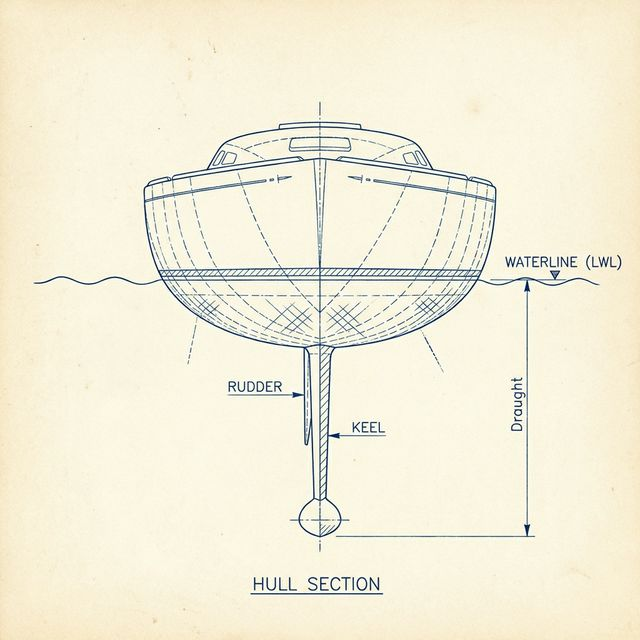
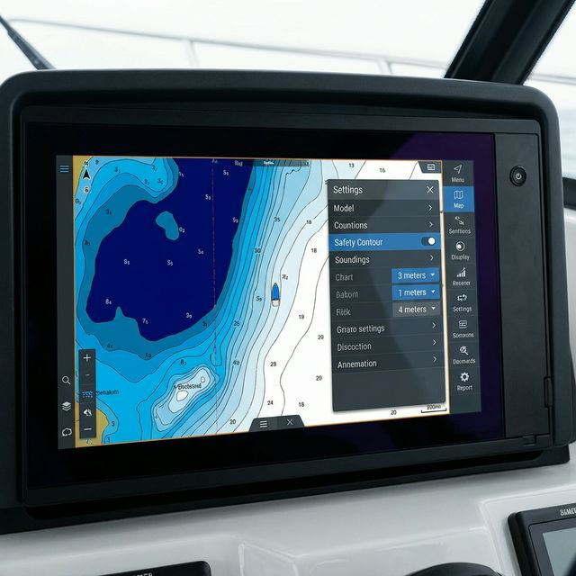

항해 중 가장 두려운 순간은 언제일까요? 폭풍우가 몰아칠 때?
아니요, 베테랑 선장들에게 물어보면 대부분 **"배 밑바닥이 긁히는 소리가 날 때"**라고 답합니다.

오늘은 내 요트의 안전을 지키는 가장 기본적이면서도 중요한 **'수심(Depth)'**에 대한 이야기를 해보겠습니다.

---

## 1. 해도에 표시되는 수심의 뜻

전자해도(Chart Plotter)나 종이 해도를 보면 숫자들이 빼곡히 적혀 있습니다. 이 숫자들은 **'바다의 깊이'**를 의미하지만, 단순히 지금 이 순간의 깊이를 말하는 것은 아닙니다.

* **해도 수심 5m**: "여기는 **아무리 물이 많이 빠져도 최소 5m**는 확보됩니다."

즉, 해도상의 수심은 항해자가 안심할 수 있는 **'최소한의 깊이'**를 약속하는 숫자입니다.

---

## 2. 기본수준면 (약최저저조면 / Lowest Astronomical Tide)

그렇다면 그 '최소한의 기준'은 무엇일까요? 바로 **기본수준면(Chart Datum)**입니다.

바다는 달과 태양의 인력으로 끊임없이 밀물(만조)과 썰물(간조)을 반복합니다.
해도를 제작할 때는 **가장 물이 많이 빠졌을 때(최저 조위)**를 기준으로 0m를 잡습니다. 이를 **약최저저조면(Approximate Lowest Low Water)** 또는 **L.A.T**라고 부릅니다.

> **정의**: 천문학적으로 예측 가능한 가장 낮은 평균 조위면. 이 이하로 수심이 낮아질 확률은 별로 없습니다. (서해안은 1년에 10일정도는 낮아지는듯 해요)

---

## 3. 조석표(Tide Table) 더해서 읽는 법

해도에 적힌 수심이 '최소 보장 깊이'라면, **지금 이 순간의 실제 깊이**는 어떻게 알 수 있을까요?
여기서 **조석표(Tide Table)**가 필요합니다.

> **실제 수심 = 해도 수심(Chart Depth) + 현재 조고(Height of Tide)**

* **해도 수심**: 5m (해도에 적힌 숫자)
* **현재 조고**: +2m (조석표나 전자해도의 Tide 정보)
* **실제 수심**: 7m

따라서 만조 때에는 해도에 '1m'라고 적힌 얕은 곳도 실제로는 3~5m 이상의 깊이가 되어 안전하게 지나갈 수 있는 것이죠.

---

## 4. 내 요트의 흘수(Draught) 알아내기

수심을 알았다면, 이제 내 배를 알아야 합니다.
**흘수(Draught)**란 물에 잠기는 배의 깊이를 말합니다. 세일 요트는 킬(Keel)이 있기 때문에 이 흘수가 꽤 깊습니다.

* **확인 방법**: 요트의 스펙(Spec) 문서를 확인하거나, 마리나에서 배를 상가했을 때 킬의 하단부터 수면 라인(LWL)까지를 직접 줄자로 재보는 것이 가장 정확합니다.
* **보통의 30-40피트 요트**: 약 1.8m ~ 2.2m

---

## 5. UKC (Under Keel Clearance) 설정하기

"내 배 흘수가 2m니까, 수심 2.1m인 곳을 지나가도 될까?"
**절대 안 됩니다.** 파도가 쳐서 배가 아래로 내려가는 순간(Squatting) 바닥을 칠 수 있기 때문입니다.

이때 필요한 여유 공간을 **UKC(Under Keel Clearance)**라고 합니다.

> **1급 해기사의 권장 UKC**:
>
> * 평온한 내항: 흘수의 10% 이상 (약 0.2m~0.5m)
> * 파도가 있는 외해: 흘수의 20%~50% 이상

---

## 6. Safety Contour 설정하기 (전자해도 팁)

마지막으로, 전자해도(Navionics 등)에서 **Safety Contour(안전 등심선)**를 설정해야 합니다.
이 기능은 설정한 수심보다 얕은 곳을 **진한 파란색**이나 **위험 지역**으로 표시해 줍니다.

> **Safety Contour = 내 배의 흘수 + 안전 여유(UKC)**

* 예: 흘수 2.0m + 여유 1.0m = **3m**
* **설정**: 전자해도 메뉴에서 `Safety Depth` 또는 `Safety Contour`를 **3m** (또는 5m)로 설정하세요.

이제 3m보다 얕은 곳은 지도가 시퍼렇게 표시하며 "가지 마!"라고 경고해 줄 것입니다. 그것만 피해 다녀도 좌초 사고의 99%는 예방할 수 있습니다.

---

바다는 아는 만큼 안전하고, 안전한 만큼 즐겁습니다.
오늘도 기본을 지키는 항해 되시기 바랍니다.

### 📚 함께 읽으면 좋은 글

* **[요트 항해 계획(Passage Planning): 1급 해기사의 A-P-E-M 원칙]()**: 정확한 수심 독해는 항해 계획의 기초입니다.
* **[요트 앵커링(Anchoring): 1급 해기사의 대형선 원리 적용과 실전 팁]()**: 안전한 정박을 위해 기본수준면 이해는 필수입니다.

**Bon Voyage!**
