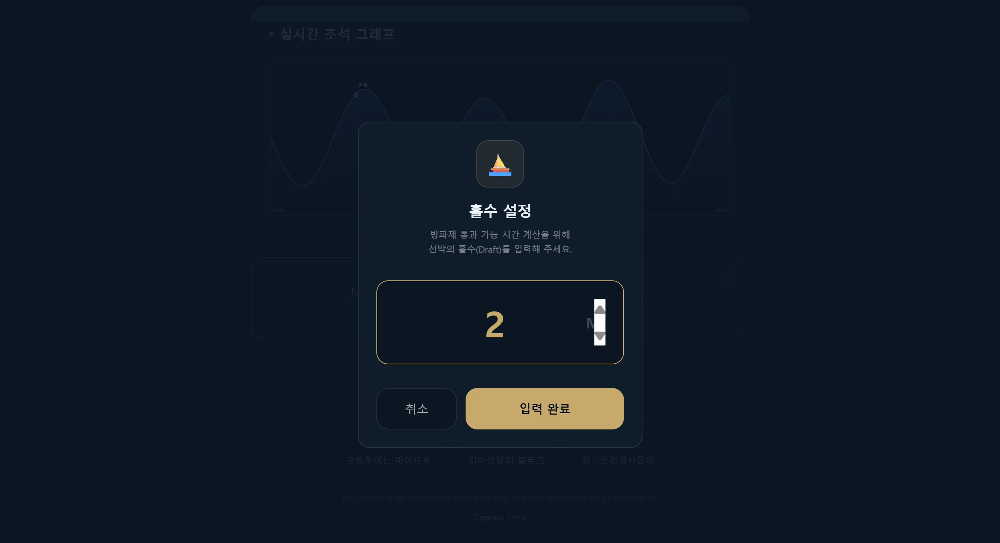
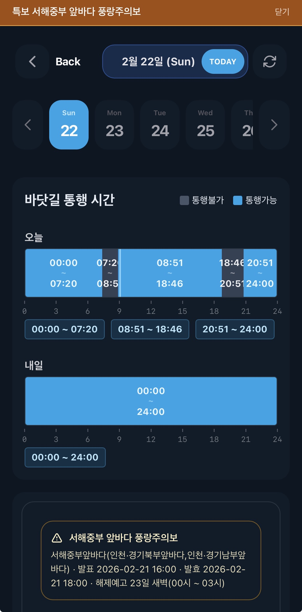

---
title: "제부도 물때 앱 제작기: 선주가 직접 만든 출항 시간 도우미"
date: 2026-02-22T09:59:36+09:00
description: "제부마리나 선주 앱을 실제 운항 관점에서 기획·개선한 제작기입니다. 제미나이 AI와 함께한 실전 바이브코딩 경험과 운영 노하우를 공유합니다."
keywords: ["제부도 물때 앱 제작기", "출항 시간 도우미 앱", "선주앱 개발", "마이요트", "제부마리나", "제미나이", "AI코딩", "바이브코딩", "앱개발"]
cover:
  image: "featured.png"
  alt: "마이요트 제부도요트 선주 앱 제작기 - 제미나이 AI와 함께하는 바이브 코딩 썸네일"
  caption: "명령어 몰라도 뚝딱! 제미나이 AI로 만든 제부마리나 선주 앱"
---

어릴 적 주말, 친구와 함께 주산학원에 다녔던 기억이 납니다. "만화영화 비디오를 틀어준다"는 원장님의 달콤한 꼬임에 넘어가서 말이죠. 결국 약속은 지켜지지 않았고, 몇 달 다니다 그만두긴 했지만요.

그때는 몰랐습니다. 주판알을 튕기는 법을 배우는 대신, 요즘처럼 AI를 불러서 무엇이든 즉석에서 배울 수 있는 세상이 올 줄 알았다면 아마 주산학원 발치에도 가지 않았을 겁니다.

> **Captain's Note:** "정보의 독점이 무너지고, 누구나 도구를 만들 수 있는 시대가 왔습니다."

### 변화의 속도: 지식의 독점이 사라진다

세상이 너무나 빠르게 변하고 있습니다. 과거에는 특정 지식이나 정보를 독점하는 것만으로도 직업을 유지하고 수익을 얻을 수 있었습니다. 하지만 이제 그런 시대는 빠르게 저물고 있습니다.

단순히 지식을 많이 아는 것보다, **"어떤 문제를 해결하고 싶은가"** 가 훨씬 중요한 시대가 된 것이죠.

### dir/w만 알던 내가 앱을 만들다니?

저는 명령어 프롬프트에서 `dir/w` 정도나 겨우 알던 사람이었습니다. 복잡한 코딩 문법은 저에게 외계어나 다름없었죠. 하지만 이번에 **제미나이(Gemini)** 와 함께 **'제부마리나 선주 앱'** 을 뚝딱 만들어냈습니다.

요즘 유행하는 말로 **'바이브 코딩(Vibe Coding)'** 입니다. 복잡한 논리 구조를 짜는 대신, AI에게 내 불편함을 이야기하고 "너라면 어떻게 개선할래?"라고 묻는 것만으로도 앱이 만들어집니다.

> **[제부마리나 선주앱 바로가기](https://jebu-marina.vercel.app/)**

이 글은 제부마리나 선주 앱을 어떤 문제의식으로 기획하고 개선했는지에 대한 제작기입니다. 앱은 제부도를 찾는 요트인들에게 필요한 물때 관련 정보를 직관적으로 보여주고, 흘수를 입력하면 1년에 약 10회 정도 출항이 어려운 시간도 확인할 수 있게 구성했습니다. (몇몇 기능은 선주협회원 비밀번호를 입력해야 이용 가능합니다.)

실제 날짜별 확인이 필요하다면 [제부도 물때·통행시간 확인은 여기서](/jebu-tide/) 바로 조회할 수 있습니다.

> **Captain's Note:** "실제 선주들이 필요한 기능을 담아내는 데 집중했습니다."

**현재 기상특보 상황, 기상 상태, 바닷길 닫힘 시간, 고조차, 회원 간 메시지 전송 기능, 방파제 앞 맹목 구간 충돌 경보, 공지 기능** 등을 제공하고 있습니다.

물론 제가 직접 코드를 한 줄 한 줄 짠 것이 아니라, AI와 대화하며 "사용자가 보기 편하게 이 부분을 바꿔줘", "물때 알람 기능을 넣어줘"라고 지시하며 완성한 결과물입니다.

### 아직도 AI를 단순하게만 쓰고 계신가요?

혹시 아직도 AI에게 오늘 환율을 물어보거나 간단한 산수 문제만 시키고 계신가요? 그렇다면 정말 큰 잠재력을 놓치고 계신 겁니다.

여러분 주변의 사소한 불편함을 AI에게 털어 놓아 보세요. 그리고 이렇게 물어보세요.
**"이게 불편한데, 어떻게 개선하는 게 좋을까? 너는 어떻게 생각해?"**

이제 도구는 빌려 쓰는 것이 아니라, 누구나 직접 만들어 쓰는 시대입니다. 마이요트도 이 새로운 물결에 올라타 더 스마트한 요트 라이프를 제안해 나가겠습니다.

**Bon Voyage!**

---

### 📚 함께 읽으면 좋은 글

* **[상용 플로터를 넘어서: OpenPlotter와 MacArthur HAT으로 나만의 통합 항해 시스템 만들기]()**: 라즈베리 파이와 오픈소스로 완성하는 나만의 항해 도구.
* **[볼보 펜타 D2-55 EVC 엔진 데이터 읽기]()**: 기성 제품의 한계를 넘어 직접 데이터를 추출하고 연동하는 즐거움.

