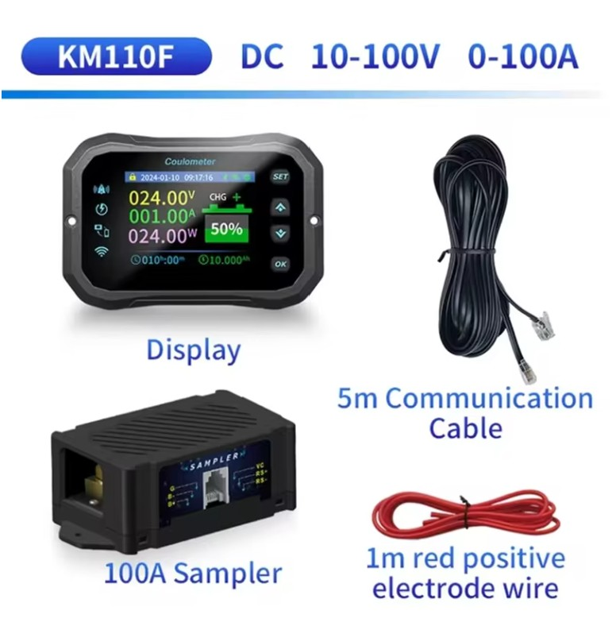
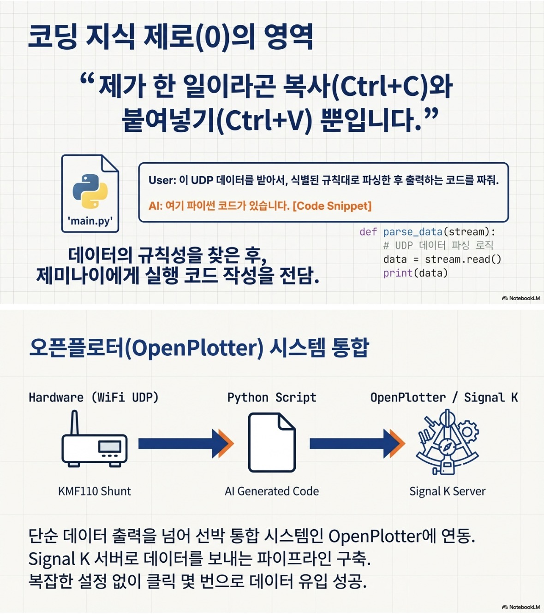

---
title: "4만원으로 요트 전력 관리 시스템 구축하기: KM110F 데이터 연동 & OpenPlotter"
seoTitle: "요트 전력 관리 구축: KM110F 데이터 연동과 OpenPlotter 통합"
date: 2026-02-05T14:30:00+09:00
summary: "Victron SmartShunt가 부럽지 않다. 전용 앱 중심인 KM110F 데이터를 제미나이(Gemini)와 함께 분석해 OpenPlotter로 통합한 실전 기록입니다."
description: "가성비 배터리 모니터 KM110F의 Wi-Fi 데이터를 분석해 OpenPlotter와 연동한 실사용 가이드입니다. Signal K 기반 전력 관리 구성을 정리했습니다."
categories: ["Marine Electronics", "DIY"]
keywords: ["KM110F 데이터 연동", "요트 배터리 모니터", "OpenPlotter", "Signal K", "DIY 전력 관리", "오픈소스항해", "제부도요트투어", "요트체험"]
draft: false
cover:
    image: "IMG_9608.jpg"
    alt: "KM110F 션트와 배터리 연결 모습"
---

> **"전용 앱만 보게 만든 장비라도, 데이터 구조를 이해하면 배 전체 시스템에 연결할 수 있습니다."**


*▲ KM110F 션트 모니터 제품 이미지*

알리익스프레스에서 4만 원 주고 산 **KM110F** 션트 모니터.
컬러 스크린도 예쁘고 가격도 착한데, 치명적인 단점이 있었습니다. 제조사에서 제공하는 **전용 앱** 으로만 데이터를 볼 수 있다는 것.

라즈베리 파이(OpenPlotter)에 통합해서 차트 플로터랑 같이 보고 싶은데... 이대로 포기해야 할까요?

그럴 리가요. 저에게는 든든한 항해사 **제미나이(Gemini)** 가 있습니다.

---

## 1. 데이터 구조부터 확인하기

처음에는 RS485 유선 연결을 고민했지만, KM110F가 **WiFi** 를 지원한다는 점에 주목했습니다.
"앱으로 데이터를 보낸다면, 그 흐름을 분석해 OpenPlotter에서도 읽을 수 있지 않을까?"

제미나이에게 물었습니다.
*"이 장비가 앱이랑 통신하는 패킷을 캡처해서 분석하고 싶어. 도와줘."*

### 📡 와이파이 데이터 분석

우리는 노트북으로 패킷 캡처를 시도했습니다. 다행히 암호화되지 않은 UDP 브로드캐스트 패킷이 날아다니고 있더군요.
하지만 16진수로 된 외계어 같은 데이터 덩어리였습니다.

---

## 2. 제미나이와 함께 프로토콜 구조 분석

캡처한 데이터를 제미나이에게 던져주자, 놀라운 일이 벌어졌습니다.

> **Gemini**: "Captain, 패턴이 보입니다. 앞부분 헤더 `0xAA` 뒤에 4바이트가 전압(Voltage)이고, 그 뒤가 전류(Current) 값인 것 같네요. 체크섬 계산 방식은 이렇습니다..."

제미나이는 금세 프로토콜을 파싱(Parsing)해 냈습니다.
단순한 숫자의 나열이 **배터리 잔량, 전압, 전류, 전력량** 이라는 의미 있는 정보로 바뀌는 순간이었습니다.

---

## 3. 파이썬(Python) 코드로 구현하기

이제 분석된 프로토콜을 바탕으로, 라즈베리 파이에서 돌아갈 **파이썬 스크립트**를 짰습니다.

1. **WiFi 수신**: KM110F가 쏘는 UDP 패킷을 라즈베리 파이가 받아냅니다.
2. **데이터 파싱**: Hex 데이터를 사람이 읽을 수 있는 십진수로 변환합니다.
3. **Signal K 전송**: 변환된 데이터를 OpenPlotter가 이해할 수 있는 Signal K 포맷(JSON)으로 쏴줍니다.

```python
# (제미나이가 짜준 코드의 핵심 부분)
def parse_packet(data):
    voltage = int.from_bytes(data[4:6], byteorder='big') / 100.0
    current = int.from_bytes(data[6:8], byteorder='big') / 100.0
    # ... Signal K로 전송 ...
```

---

## 4. OpenPlotter 연동 완료

결과는 성공적이었습니다!
이제 4만 원짜리 션트 저항이 30만 원짜리 Victron 장비처럼 작동합니다.


*▲ Signal K 대시보드에 표시된 KM110F 데이터. 전용 앱 밖에서도 바로 확인할 수 있습니다.*

### 💡 이 시스템의 장점

* **선 없는 자유**: WiFi로 통신하니 거추장스러운 RS485 배선이 필요 없습니다.
* **완벽한 통합**: **Signal K** 를 통해 다른 항해 계기들과 데이터를 공유합니다.
* **AI와의 협업**: 코딩을 몰라도 제미나이와 함께라면 데이터 구조 분석과 파싱 검증 속도를 크게 줄일 수 있습니다.

---

**Captain's Note:**
전용 앱에 묶여 있는 장비라도, 공개적으로 보이는 통신 흐름을 차근차근 분석하면 내 배 시스템에 맞게 연결할 수 있습니다.
이제 제 배의 배터리는 제미나이와 제가 만든 코드로 24시간 감시됩니다.

*PS. 혹시 코드가 필요하신 분은 댓글 남겨주세요!*

---

### 📚 함께 읽으면 좋은 글

* **[상용 플로터를 넘어서: OpenPlotter와 MacArthur HAT으로 나만의 통합 항해 시스템 만들기]()**: 배터리 데이터까지 통합된 완벽한 항해 시스템을 만나보세요.
* **[요트 항해 계획(Passage Planning): 1급 해기사의 A-P-E-M 원칙]()**: 안정적인 전력 관리 시스템은 장거리 항해의 필수 조건입니다.

**Bon Voyage!**

