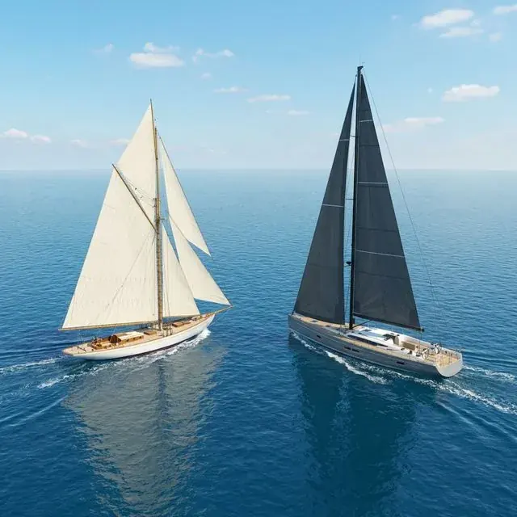

바다 위에는 차선도 없고 신호등도 없지만, 전 세계 모든 선장이 약속한 **'보이지 않는 약속'** 이 있습니다. 바로 **국제해상충돌예방규칙(COLREG)** 과 국내의 경우 **해상교통안전법** 이죠.

많은 분이 "국제법과 국내법 중 뭘 따라야 하나요?" 라고 묻곤 합니다. 결론부터 말씀드리면, 우리나라는 **국제해사기구(IMO)** 의 핵심 회원국이기 때문에 이 둘은 사실상 '하나의 뿌리' 를 가지고 있습니다.

1. **COLREG (국제해상충돌예방규칙)**: 1972년 IMO에서 채택된 전 세계 공통의 '바다 위 약속' 입니다. 공해와 이에 연결된 항행 가능한 수역에 적용되는 글로벌 표준이죠.
2. **해상교통안전법**: 대한민국은 IMO 회원국으로서 COLREG의 원칙을 국내법에 수용하고 있으며, 국가의 영해에서는 해당 국가의 법이 우선 적용됩니다. 우리나라에서는 그 기준이 **해상교통안전법** 에 반영되어 있습니다.

대부분의 **항해사** 나 **선장** 들은 이 복잡한 법규를 머릿속에 넣고 다닙니다. 마치 내비게이션처럼 말이죠. 오늘은 리마 선장과 함께 초보자도 쉽게 알 수 있는 바다 위의 기본 항법과 그 속에 담긴 따뜻한 이야기를 나눠보겠습니다.

우리가 운전할 때 도로교통법의 큰 틀을 외우듯 항해도 마찬가지입니다. 교통표지판의 의미를 아는 것이 해도 심볼을 이해하는 일이고, 1차선이 추월차선이라는 룰을 아는 것처럼 국제해상충돌예방규칙의 핵심 규정은 초보 단계를 벗어나는 데 필수적입니다.

---

## 1. 좌현 대 좌현

도로 위의 차들이 우측통행을 하듯, 바다에서 배가 서로 마주 보고 올 때는 각자의 **좌현(왼쪽)** 을 마주하고 지나가는 것이 기본입니다. 즉, 서로 오른쪽으로 키(Wheel)를 꺾어 피하는 것이죠.
과거 범선 시절에는 휠이 타(Rudder)와 로프로 연결되어, 휠을 왼쪽으로 꺾으면 배는 오른쪽으로 회두하고 오른쪽으로 꺾으면 왼쪽으로 회두하는 구조였다고 합니다.
영화 *타이타닉* 에서도 항해사가 조타수에게 "하드 포트(좌현 전타)" 오더를 내리고, 조타수가 오른쪽으로 휠을 돌리는 장면을 볼 수 있습니다.

*물론 두 척 다 범주 중(기관 미사용)일 때는 **'좌현 대 좌현'** 원칙이 아닌 범선 간 항법이 우선 적용됩니다.*

## 2. 뒤에서 올 땐 누가 비킬까? (추월선의 의무)

더 빠른 배가 뒤에서 앞서가던 배를 앞질러 갈 때가 있습니다. 이때는 **'추월하는 배(추월선)'** 가 모든 피항 의무를 집니다.

밤을 예로 들면, 앞배의 양옆 등불(현등)은 보이지 않고 오직 뒤쪽의 하얀 **'선미등'** 만 보이는 각도에서 접근한다면 당신은 추월선입니다. 추월을 시작해서 내 배가 앞선 배를 완전히 앞지르고 내 선미등이 그 배에게 보일 정도로 멀어질 때까지 추월선은 안전하게 피할 책임을 끝까지 져야 합니다. 앞선 배는 자신의 코스를 유지할 권리가 있으니까요. 그럼에도 불구하고 피추월선도 협조 동작을 해주는 것이 좋습니다.

## 3. 방파제에서는 '나가는 배'가 우선 (Outbound First)

제부도 마리나처럼 방파제 사이의 좁은 입구를 통과할 때는 특별한 규칙이 적용될 수 있습니다. 여기서 말하는 **'출항선(나가는 배) 우선'** 은 국제해상충돌예방규칙의 일반 원칙이라기보다, 우리나라 **「선박의 입항 및 출항 등에 관한 법률」** 체계와 항만·마리나의 개별 운영규정(관제 지시 포함)에 따른 로컬 운용 원칙으로 이해하는 것이 정확합니다. 실무에서는 들어오는 배가 나가는 배의 진출 공간을 먼저 확보해 주는 방식으로 운영되는 경우가 많습니다.

여기에는 가슴 뭉클한 바다의 전통이 담겨 있습니다.

> "출항선에 우선권을 주는 이유는, 가족과 집을 뒤로하고 거친 먼바다로 나가는 배에 대한 예우이자 배려입니다."

저는 이 규칙을 설명할 때마다 **Good Seamanship** 과 가족의 소중함을 강조하곤 합니다. 안전하게 임무를 마치고 돌아오는 배가 이제 막 모험을 시작하는 배를 위해 길을 비켜주는 것, 이것이 바로 같은 바다에 있는 뱃사람들 간의 예절입니다.

---

## 4. 마리나 안에서의 항법: 좁은 수로의 예절

좁은 마리나 내부에서는 엔진 소리보다 '눈치'와 '배려'가 더 중요합니다. 특히 막다른 길에서 마주쳤을 때는 더 기동성이 좋은 배(혹은 방해가 덜 되는 위치의 배)가 먼저 양보하는 미덕이 필요하죠.

- **서행(Safe Speed)과 No Wake:** 마리나 내에서는 배가 만드는 파도(Wake)가 계류 중인 다른 배들에 큰 충격을 줄 수 있습니다. '가장 느린 속도'가 기본입니다.

- **안전한 속도** 는 시계, 교통밀도, 조종성에 따라 달라지나 기본은 **언제든 멈출 수 있는 속도** 입니다.

## 5. 유지선과 피항선, 그리고 '상호협조동작'

항법에서는 길을 비켜줘야 하는 **피항선(Give-way Vessel)** 과 자기 코스를 유지해야 하는 **유지선(Stand-on Vessel)** 을 나눕니다. 하지만 **COLREG** 에서는 단순히 법만 따지는 것을 경계합니다.

유지선이라 할지라도 상대방이 피하지 않아 위험이 감지된다면, 즉시 **'상호협조동작'** 을 취해 충돌을 피해야 합니다. "내가 우선순위니까 네가 비켜!"라고 고집부리는 것은 바다에서 가장 위험한 태도입니다.

---

### ⚓ 결론: 결국은 Good Seamanship

리마 선장이 입버릇처럼 하는 말이 있습니다. **"법 위에 있는 것이 굿 시맨십(Good Seamanship)이다."**

현대의 항법은 과거 범선 시절부터 내려오는 Good Seamanship을 기반으로 만들어졌습니다. **태킹(Tacking)** 을 해야 하는 배를 만나면 **자이빙(Gybing)** 하는 배가 양보해주던 미덕들이 관습법이 되고 현대의 항법이 된 것입니다.

아무리 법규를 잘 지켜도 상대방을 배려하지 않는 항해는 사고로 이어질 수 있습니다. 바다 위에서 수평선을 바라보며 서로에게 손을 흔들어주는 그 여유와 배려가 곧 최고의 항법입니다.

제부도의 아름다운 바다를 누빌 때, 우리 모두 **멋진 세일러** 가 되어보는 건 어떨까요?

---

### 📚 함께 읽으면 좋은 글

* **[요트 정박의 예술, 안전한 앵커링 가이드]()**: 정박 전 준비부터 앵커 세팅까지 핵심만 정리했습니다.
* **[완벽한 항해를 위한 항해 계획(Passage Planning) 세우기]()**: 출항 전 점검 루틴과 계획 수립 순서를 확인해 보세요.

### 📖 참고 법령 및 공식 출처

* **[IMO COLREG Convention](https://www.imo.org/en/About/Conventions/Pages/COLREG.aspx)**: 국제해상충돌예방규칙 공식 개요입니다.
* **[국제해상충돌예방규칙(국문 조약)](https://www.law.go.kr/trtyMInfoP.do?trtySeq=2338)**: 국내 제공 국문 조약문입니다.
* **[해상교통안전법 제83조(항법)](https://www.law.go.kr/lsSideInfoP.do?chrClsCd=010202&docCls=jo&joBrNo=00&joNo=0083&lsId=&lsiSeq=252871&urlMode=lsScJoRltInfoR)**: 항법의 기본 원칙입니다.
* **[해상교통안전법 제84조(안전속력)](https://www.law.go.kr/lsSideInfoP.do?chrClsCd=010202&docCls=jo&joBrNo=00&joNo=0084&lsId=&lsiSeq=252871&urlMode=lsScJoRltInfoR)**: 안전속력 판단 기준입니다.

**Bon Voyage!**
