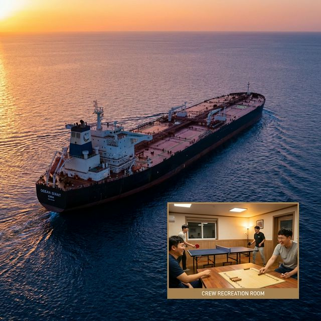

명절이 되면 모두가 고향으로 향하는 설레는 마음을 안고 길을 나섭니다. 하지만 저의 30대는 조금 달랐습니다. 가족의 품 대신, 끝을 알 수 없는 수평선을 마주하며 336미터에 달하는 거대한 원유선(VLCC) 위에서 명절을 맞이하곤 했죠.

오늘 그 대양 위에서 피어났던 뜨거운 사람 냄새 나는 이야기를 꺼내볼까 합니다.

## ⚓ 명절, 멈추지 않는 항해의 현장

상선 사관들에게 명절은 '휴일'이 아닙니다. 배는 365일 24시간 돌아가야 하니까요. 특히 항해 당직 사관들에게 명절은 평화로운 풍경이라기보다, 늘어나는 무전 소리와 더 예민하게 살펴야 하는 레이더의 연속입니다. 입출항이나 좁은 수로 통과 시점이 명절과 겹치기라도 하면, 고향 생각은커녕 안전한 항로를 확보하는 데 온 신경을 쏟아야 했습니다.

*▲ 336미터에 달하는 거대한 원유선(VLCC)은 대양 위에서도 압도적인 존재감을 드러냅니다.*

## 🏓 실내에서 터져 나오는 "윷이야!"

그래도 운 좋게 탁 트인 대양(Ocean) 한가운데서 명절을 맞이하면 선상에도 작은 활기가 돕니다. 기상 상태가 허락하는 날, 실내 휴게실에서는 '상선 올림픽' 부럽지 않은 탁구 대회와 윷놀이 판이 벌어집니다.

거대한 기계음만 가득하던 배 안에 "윷이야!" 하는 함성이 울려 퍼질 때면, 잠시나마 멀리 있는 가족에 대한 그리움을 잊고 동료들과 한바탕 웃음꽃을 피웠습니다.

## 🍤 인도산 새우 한 드럼의 행복, $70의 기적

선상의 명절에는 <strong>'특식'</strong>이 빠질 수 없습니다. 하루 식비가 더블로 지급되기에 주방은 평소보다 분주해지죠.

명절전에 인도에 기항했을 때, 단돈 70달러에 새우 한 드럼(Drum)을 가득 시켰던 적이 있습니다. 명절 파티 날, 산더미처럼 쌓인 새우 요리를 나누며 먹던 그 맛은 세상 그 어떤 산해진미보다 달콤했습니다. 바다 사나이들이 새우 껍질을 까주며 서로를 격려하던 그 따뜻한 풍경이 지금도 눈에 선합니다.

## ❤️ 선장이기 전에 동료였던 마음으로

저는 승선 중 명절이나 휴일이 되면 한 달에 한 번 정도는 일부러 당직 항해사를 대신해 브릿지에 서곤 했습니다.

거창한 희생이 아니라, 같은 배를 탄 동료로서 그들이 잠시라도 편히 쉬며 고향에 안부 인사라도 할 수 있기를 바라는 마음이었습니다. 제가 제복을 입고 수평선을 지키고 있을 때, 동료가 가족의 목소리를 들으며 웃을 수 있다면 그것으로 충분했습니다.

### 🚢 항해를 마무리하며

기술관련 글이 아니라 젊은 시절을 보낸 바다의 이야기를 회상하는 첫 글을 적다 보니 그때의 짠 내음과 습했던 바람이 다시 느껴지는 것 같습니다. 지금은 마이요트에서 제부도 바다를 지키고 있지만, 그때 그 거대한 배 위에서 배운 <strong>'함께하는 항해'</strong>의 가치는 변함이 없습니다.

비록 몸은 떨어져 있어도, 같은 바다를 바라보며 마음을 나누는 것. 그것이 선장인 제가 그리는 마이요트의 정신입니다.

여러분도 이번 명절, 곁에 있는 소중한 사람들과 따뜻한 새우 파티(?) 같은 즐거운 시간 보내시길 바랍니다.

<strong>Bon Voyage!</strong>

---

### 📚 함께 읽으면 좋은 글

* <strong>[2026년 새로운 시작, 마이요트의 다짐]()</strong>: 리마 선장이 전하는 새해 인사와 마이요트의 비전.
* <strong>[1급 해기사가 알려주는 안전한 요트 항해법]()</strong>: 상선 사관의 노하우가 담긴 실전 항해 계획 수립 가이드.
