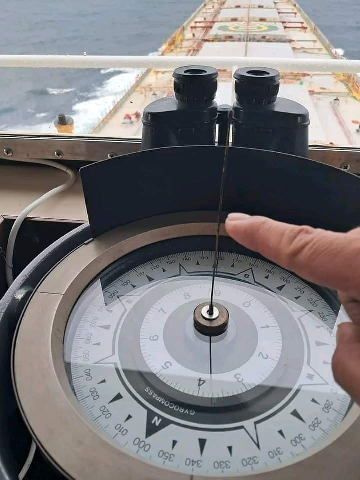
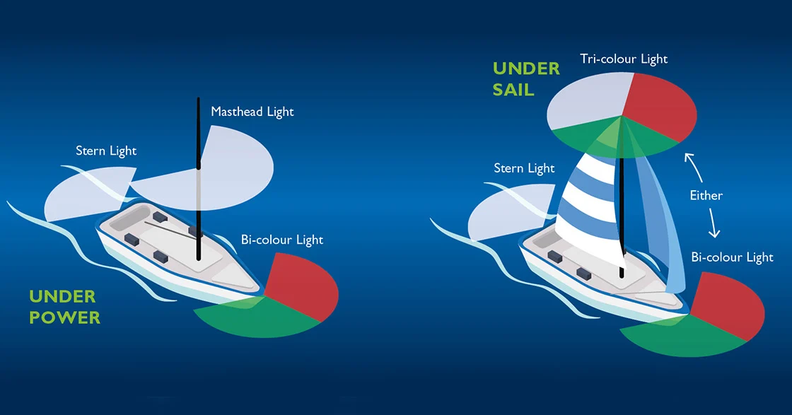
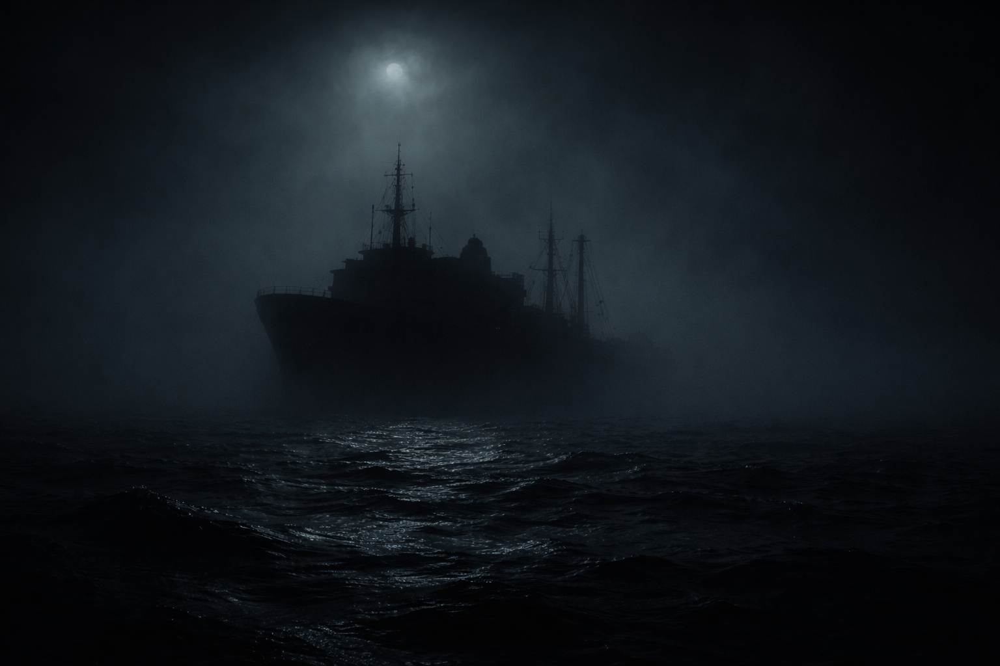

항해를 시작하면 가장 먼저 접하는 기본이면서도, 요즘은 디지털 장비에 밀려 잊혀져 가는 기본 개념 중 하나가 바로 **포인트(Point)** 입니다.

오늘은 360도라는 숫자를 넘어, 항해사들의 전통적인 언어인 1포인트에 대해 알아보고, 이것이 우리 배의 안전등(항해등)과 어떤 밀접한 관계가 있는지 정리해 보겠습니다.

---

## 🧭 1포인트(Point)의 정의

우리가 흔히 쓰는 나침반의 360도를 계속해서 반으로 나누어 가다 보면 어떤 숫자가 나올까요?

1. 360도 ÷ 2 = 180도
2. 180도 ÷ 2 = 90도 (Cardinal Points: N, S, E, W)
3. 90도 ÷ 2 = 45도 (Intercardinal Points: NE, SE, SW, NW)
4. 45도 ÷ 2 = 22.5도
5. **22.5도 ÷ 2 = 11.25도**

이렇게 360도를 **32등분** 했을 때 나오는 하나의 각도, **11.25도** 를 우리는 **1포인트(1 Point)** 라고 부릅니다.

*▲ 32등분 자이로 리피터*

### 🔍 2포인트(22.5도)와 익숙한 방위들

1포인트(11.25도)가 두 개 모이면 **2포인트(22.5도)** 가 됩니다. 우리가 흔히 기상 예보나 항해 계획에서 듣는 **NNE(북북동)** , **ENE(동북동)** 같은 명칭들이 바로 이 2포인트 단위를 부르는 이름입니다.

- **N (0도)** -> **NNE (22.5도)** -> **NE (45도)**
- 이렇게 360도를 아주 세밀하게 쪼개어 부르는 것이 전통 항해사들의 약속이었습니다.

과거 범선 시대에는 조타수에게 "Port 1 Point!"(좌현으로 11.25도 변침!)와 같이 구령을 내리곤 했습니다. 지금은 잊혀져 가는 명령이지만, 항해학의 많은 기본 공식들은 여전히 이 11.25라는 숫자를 바탕으로 설계되어 있습니다.

---

## 🌊 실전 항해에서의 활용

### 1. 황천 항해와 피항 (Heave-to & Scudding)

거친 파도를 만났을 때 배의 안전을 지키기 위한 전술인 **히브 투 (Heave-to)** 나 **스커딩 (Scudding)** 시 파도를 받는 각도가 매우 중요합니다.

- **원칙** : 파도를 정면이나 정후면에서 받는 것은 위험합니다. 선수 혹은 선미의 **약 2~3포인트 (약 22.5~33.75도)** 방향으로 파도를 비껴 맞으며 조타하는 것이 기본입니다. (이 기술적인 부분은 나중에 더 자세히 다룰 예정입니다.)

### 2. 항해등(Navigation Lights)의 각도

우리가 밤바다에서 켜는 항해등의 눈부신 각도들도 사실 이 '포인트' 단위로 딱딱 끊어져 설계되었습니다.

| 등화 종류 | 포인트(pt) | 각도(Degree) | 설명 |
| :--- | :---: | :---: | :--- |
| **현등 (Side Lights)** | **10 pt** | **112.5도** | 정선수에서 양현 90도를 지나 뒤쪽 22.5도까지 |
| **기주등 (Masthead Light)** | **20 pt** | **225.0도** | 정선수 기준 양현 10pt씩 비춤 |
| **선미등 (Stern Light)** | **12 pt** | **135.0도** | 정선미 기준 12pt씩 비춤 |

*▲ 정확한 각도로 빛을 발하고 있는 요트의 모습. 이 각도는 1포인트 단위의 합산으로 이루어져 360도를 빈틈없이 비추고 있습니다. 기주중일때와 범주중일때의 등화는 다릅니다.*

---

## 💡 선장의 팁: "홍녹등"이라 불러주세요

항해를 하다 보면 가끔 현등을 "청/홍등"이라 부르시는 분들을 봅니다. 심지어 유튜브 등에서 전문가라고 하시는 분들조차 그렇게 말씀하시는 걸 보면 참 안타깝습니다.

**정확한 명칭은 "홍녹등" 입니다.**

- **좌현 (Port)**: **홍색 (Red)**
- **우현 (Starboard)**: **녹색 (Green)**

신호등의 '파란불'처럼 관습적으로 쓰시는 건 이해하지만, 바다에서의 명칭은 정확해야 합니다. "홍녹등" 이라고 부르는 것이 요티로서의 기본 예의이자 가장 기본적인 지식입니다.

---

## 🛡️ 안전을 위한 마지막 점검

*▲ 어두운 밤, 항해등을 켜지 않은 선박이 얼마나 위험한지 시각적으로 보여주는 장면입니다.*

항해등은 단순히 법규를 지키기 위한 수단이 아닙니다. 내가 다른 배에게 내가 어디로 가고 있는지, 내가 어떤 상태인지 알려주는 **나의 생명줄** 입니다.

조사 각도가 잘못 설치되어 있지는 않은지, 전구가 나간 곳은 없는지 출항 전 반드시 점검해 보시길 권장합니다. 안전검사원으로 수상레저기구 검사를 다닐 때마다 누누이 강조드리는 사항입니다.

**Tip: 1** USCG(미국 해안경비대)에서는 항해등의 광달거리를 최소 3마일 이상으로 규정하고 있습니다. LED lamp로 바꾸시면 전력관리에도 도움되실거에요.

**Tip: 2** 제가 정확한 용어를 강조하는 이유는 여러분들은 모두 International Seaman 이기 때문입니다. 잘못 외우시면 외국 나가서 의사소통이 안되실 수 있습니다.  예) 리데나씰 은 **Retainer Seal** 입니다.

모두의 안전한 세일링을 기원하며, 편한밤 되세요~

---

### 📚 함께 읽으면 좋은 글

- **[요트 계류 매듭 (Cleat Hitch) 의 정석: 1급 해기사의 실전 노하우]()** : 안전한 정박의 시작은 올바른 매듭에서 시작됩니다.
- **[요트 항해 계획 (Passage Planning) : 1급 해기사의 A-P-E-M 원칙]()** : 출항 전 기초가 되는 항해 계획을 점검해보세요.

**Bon Voyage!**
