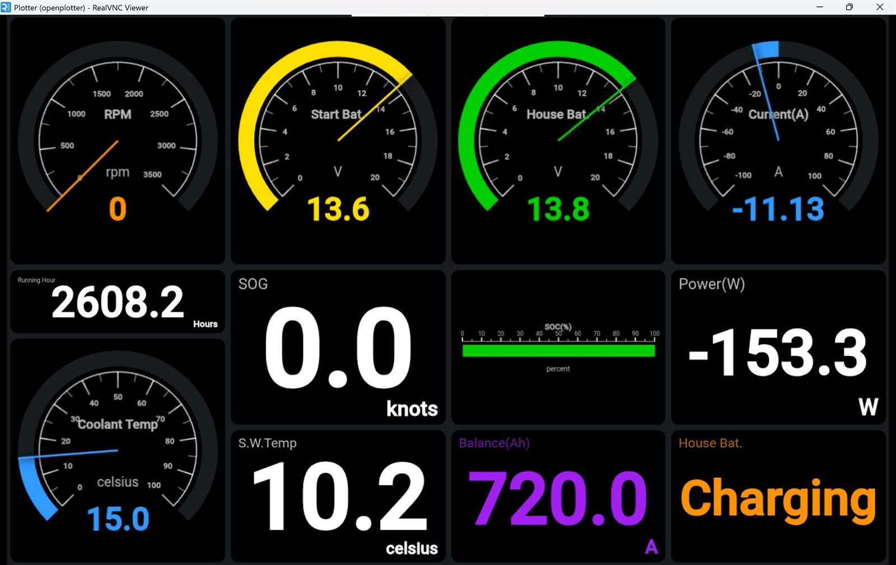
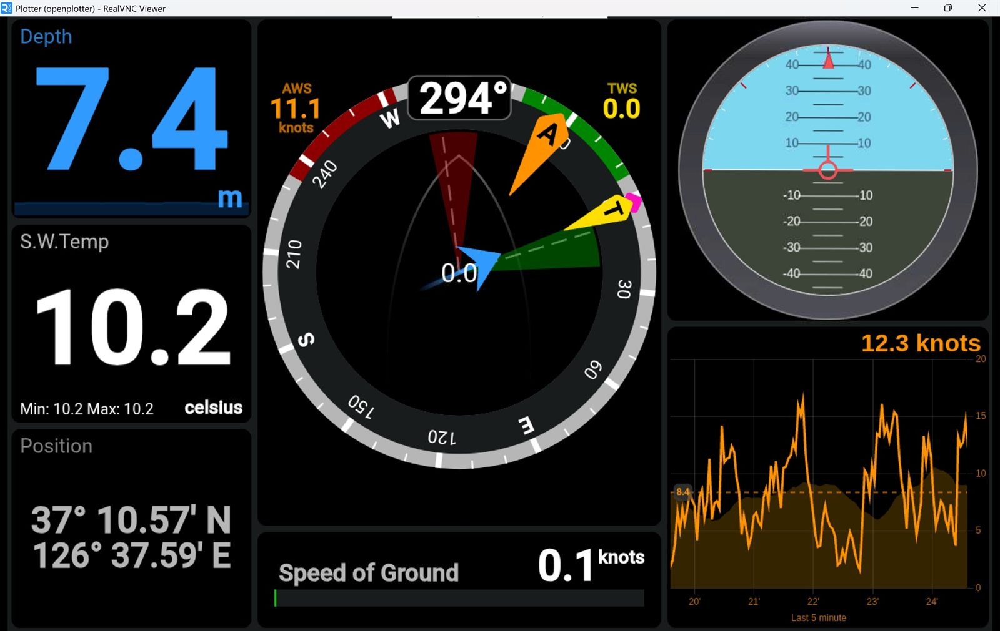
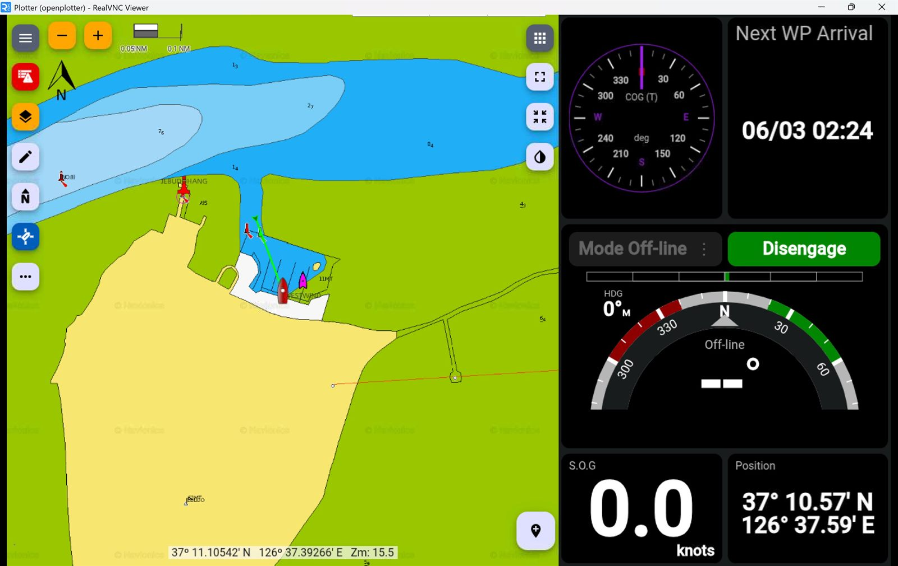
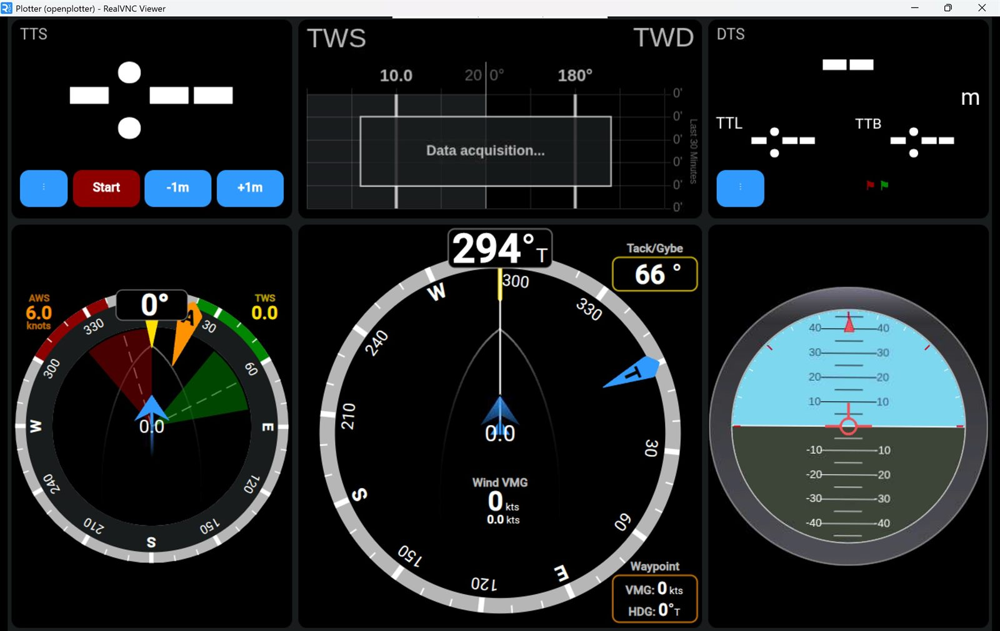
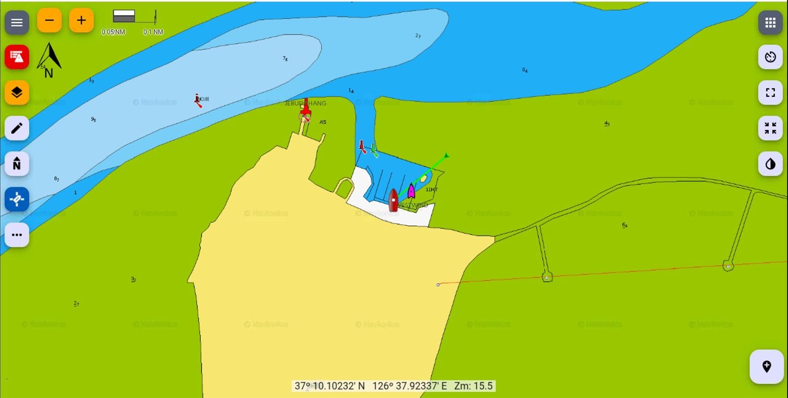

---
title: "10만원대로 여기까지 된다고? 오픈플로터 설치 완전입문 (KIP 화면)"
seoTitle: "오픈플로터 설치 완전입문: KIP 화면, FreeboardSK, Signal K 연결 가이드"
date: 2026-03-05T20:30:00+09:00
summary: "초보자도 따라 할 수 있게 라즈베리파이 4에 OpenPlotter를 설치하고, Signal K 앱 KIP 대시보드까지 띄우는 과정을 단계별로 정리했습니다."
description: "오픈플로터 설치 입문 가이드. 라즈베리파이 4에서 Signal K, KIP 화면, FreeboardSK를 연결해 10만원대로 통합 항해 화면을 구성하는 방법을 설명합니다."
categories:
  - "Marine Electronics"
  - "DIY"
keywords:
  - "마이요트"
  - "제부도요트"
  - "OpenPlotter 설치"
  - "Signal K"
  - "KIP 대시보드"
  - "라즈베리파이4 8GB"
  - "요트 차트플로터 DIY"
cover:
  image: "thumbnail.jpg"
  alt: "OpenPlotter와 FreeboardSK/KIP 화면을 라즈베리파이에 구성한 통합 항해 UI"
  caption: "무료 웹 차트플로터와 KIP 화면으로 시작하는 OpenPlotter 입문"
author: "Captain Lima"
draft: false
---

> 이건 뭐 같나요?

*▲ KIP 화면 1: 엔진/배터리 상태*

*▲ KIP 화면 2: 풍향/풍속 + SOG/COG*

*▲ KIP 화면 3: 차트/오토파일럿*

*▲ KIP 화면 4: 레이싱모드(VMG)*

이 화면은 단순히 예쁜 계기판이 아닙니다.  
쉽게 비유하면 구조는 이렇게 보시면 됩니다.

- **OpenPlotter = OS(기반 운영체제)**: 라즈베리파이에 해상용 도구를 올려주는 바닥. 필수 유틸이 기본설치되어 있음
- **Signal K = 서버(데이터 허브)**: 엔진/배터리/GPS/풍향 데이터를 모아 표준 API로 내보내는 중심
- **KIP = 웹앱(UI)**: 그 데이터를 사람이 즉시 읽을 수 있는 대시보드로 보여주는 프론트엔드

즉 KIP는 "앱 하나"를 넘어서, OpenPlotter + Signal K 위에서 돌아가는 앱 생태계를 눈으로 쓰게 해주는 시작점입니다.
핵심 장점은 기기 제약이 적다는 점입니다. 휴대폰, 태블릿, 노트북처럼 어떤 휴대용 디바이스든 서버에 연결하면 같은 데이터 화면을 동시에 볼 수도 기기별로 다른 화면을 볼 수도 있습니다. 

한 줄 요약하면, OpenPlotter가 기반을 만들고 Signal K가 데이터를 모으며 KIP와 웹앱이 그 결과를 실시간 화면으로 보여줍니다.

핵심은 확장성입니다. 항해 스타일이 바뀔 때마다 앱을 추가해 기상, AIS, 라우팅, 경보, 원격 모니터링까지 계속 붙일 수 있습니다.
결국 사람들이 가장 흥미를 느끼는 건 "데이터가 운항 화면으로 살아나는 순간"이고, KIP는 그 출발점입니다.

## 일반 차트플로터보다 왜 재미있나

상용 차트플로터는 안정적이지만, 화면 구성과 확장성은 제한적일 때가 많습니다.  
반면 **OpenPlotter + Signal K + KIP** 조합은:

1. 대시보드 페이지를 상황별로 여러 장 운영
2. 엔진/배터리/풍향/GPS/수심/로그를 한 화면에 자유 배치
3. Signal K 경로 기반으로 알림/자동화 연동
4. 태블릿, 노트북, 콕핏 모니터를 같은 데이터 소스로 동기화

쉽게 말해 "장비에 사람이 맞추는 방식"이 아니라, "배와 운항 습관에 맞춰 장비를 커스터마이징하는 방식"입니다.

## 설치 후 확장 기능: 기상도, AIS, 위성 수신까지

설치가 끝나면 여기서 재미가 시작됩니다. 아래 기능을 포함한 여러 앱들을 무료로 설치할 수 있습니다.

### 1) FreeboardSK (무료 웹 차트플로터)

*▲ FreeboardSK: 브라우저 기반 무료 차트플로터 화면*

- FreeboardSK는 Signal K 서버 위에서 동작하는 무료 웹 기반 차트플로터라서, 브라우저만 있으면 기기 종류와 상관없이 바로 사용할 수 있습니다.
- 기본적으로 선박 위치/침로 기반 이동지도, North-up/Vessel-up 전환, 온라인/로컬 차트 오버레이를 지원합니다.
- 경로(Route)·웨이포인트(Waypoint) 생성/편집, AIS 표출, 알람/알림, 기상 정보 레이어를 한 화면에서 함께 다룰 수 있습니다.
- 요약하면 "설치 직후 바로 쓸 수 있는 무료 MFD 화면"으로 시작하고, 필요할 때 KIP와 조합해 계기 대시보드를 확장하는 흐름이 좋습니다.

### 2) 기상도/기상항로

- OpenPlotter 4 `Starting` 이미지에는 기본 앱으로 `Xygrib` 이 포함됩니다.
- OpenCPN의 GRIB 플러그인은 내부 플러그인으로 기본 제공됩니다.
- Weather Routing 플러그인은 GRIB 예측 + Climatology 데이터를 조합해 항로 최적화를 계산합니다.
- Climatology 플러그인은 평균 풍향/풍속, 강수/습도/운량, 열대저기압 트랙 같은 장기 기후 오버레이를 제공합니다.

### 3) RTL-SDR 기반 AIS 수신

- OpenPlotter의 `SDR VHF` 앱은 RTL-SDR 장치를 쉽게 쓰도록 설계되어 있고, AIS 디코딩 사용 사례를 명시합니다.
- OpenPlotter `AIS` 도구는 SDR 장치/게인/PPM 설정 후 UDP 포트(기본 `10110`)로 내보내며, 문서상 Signal K에 해당 포트 연결이 자동 생성됩니다.
- OpenCPN에도 RTL-SDR 플러그인이 있어 저가 TV 동글을 AIS 수신기로 활용할 수 있습니다.

### 4) 위성/고급 RF 수신 확장

OpenPlotter SDR VHF 문서에는 아래 활용 예시가 직접 나옵니다.

- NOAA 기상위성 이미지 수신
- 위성 및 ISS 청취
- Inmarsat STD-C EGC 디코딩
- 기상관측용 웨더벌룬 데이터 수신

이 구간은 안테나/주파수 환경/지역 전파법 영향을 크게 받으니, 설치 후에는 "수신 테스트 -> 로그 확인 -> 안정화" 순서로 접근하는 게 좋습니다.

### 5) VMG 앱(성능/레이싱)

- VMG(Value Made Good)는 목표 지점 또는 바람 축 기준으로 "실제로 얼마나 잘 전진하고 있는지"를 보여주는 핵심 성능 지표입니다.
- Signal K 성능 앱/플러그인과 KIP 레이싱 화면을 함께 쓰면 현재 VMG와 목표 VMG를 같은 화면에서 비교할 수 있습니다.
- 이 값이 보이기 시작하면 택 전환 시점, 세일 트림 조정, 업윈드/다운윈드 전략 판단이 훨씬 빨라집니다.

## 비용부터 현실적으로: 라즈베리파이 4 8GB, 당근마켓 10만원대면 시작 가능

2026년 기준으로, 당근마켓에서 **라즈베리파이 4 8GB** 를 상태 좋은 중고로 대략 10만원 안팎에 구할 수 있습니다.
처음 입문이라면 이 정도 구성이 가장 부담이 적고, 성능도 충분합니다.

### 준비물 체크리스트

- 라즈베리파이 4 (8GB 권장)
- microSD 카드 (최소 32GB, 가능하면 64GB A2)
- 정격 전원 어댑터 (5V 3A)
- HDMI 케이블 + 모니터, 키보드/마우스
- 유선 LAN 또는 안정적인 Wi-Fi

## 설치 1단계: OpenPlotter 이미지 다운로드

1. OpenPlotter 공식 사이트에서 최신 Raspberry Pi 이미지를 다운로드합니다.
2. 초보 입문은 `OpenPlotter Starting` 이미지부터 시작하면 가장 빠릅니다.
3. 파일 무결성(체크섬)을 제공하면 함께 확인합니다.

### 실제 다운로드 링크

- OpenPlotter 다운로드 안내(공식): <https://openplotter.readthedocs.io/latest/getting_started/downloading.html>
- OpenPlotter Starting: <https://cloud.openmarine.net/s/TwxS4AJrtTJ485T>
- OpenPlotter Headless: <https://cloud.openmarine.net/s/cMJrfH45aPeamFc>
- OpenPlotter Touchscreen: <https://cloud.openmarine.net/s/3gjyKsrpKRb6ZHe>
- Raspberry Pi Imager 안내/다운로드: <https://www.raspberrypi.com/software/>
- Raspberry Pi Imager Windows(직접): <https://downloads.raspberrypi.com/imager/imager_latest.exe>

## 설치 2단계: Raspberry Pi Imager 로 SD 카드에 쓰기

1. PC에서 **Raspberry Pi Imager** 를 실행합니다.
2. `Use custom` 을 선택해 방금 받은 OpenPlotter 이미지 파일을 고릅니다.
3. 대상 SD 카드를 선택하고 `Write` 를 눌러 기록합니다.
4. 검증(verify) 단계는 가능하면 끝까지 완료합니다.

### 설치 중 중요한 주의사항

- OpenPlotter 이미지 설치 시, Imager의 `Apply custom OS settings` 질문에는 `NO`를 선택하는 절차가 공식 문서에 명시되어 있습니다.
- OpenPlotter 4 문서 기준으로 기본 사용자 `pi` 전제를 깔고 앱이 구성되어 있어, 사용자명을 바꾸면 정상 동작이 깨질 수 있습니다.

## 설치 3단계: 첫 부팅과 기본 설정

SD 카드를 라즈베리파이에 넣고 부팅합니다.
첫 부팅에서는 아래 4가지만 먼저 정리하면 됩니다.

1. 언어/시간대: `Asia/Seoul`
2. Wi-Fi 또는 LAN 네트워크 연결
3. 비밀번호 변경 (호스트명은 기본 `pi` 유지)
4. 시스템 업데이트

## 설치 4단계: Signal K 와 KIP 설치/활성화

1. OpenPlotter에서 Signal K 메뉴로 들어갑니다.
2. Signal K 서버를 실행하고 웹 UI(`:3000`) 접속을 확인합니다.
3. Signal K App Store 에서 **KIP** 을 설치합니다.
4. 브라우저 또는 태블릿에서 KIP 를 열고 페이지를 4개 만들어 봅니다.

### KIP 화면 권장 구성 (초보용)

1. 엔진/배터리 상태
2. 풍향/풍속 + SOG/COG
3. 차트 + 오토파일럿 관련 위젯
4. 레이싱/성능(VMG, 시작선 등)

## 내 항해기기별 연결 요령: SeaTalk1, SeaTalkNG, NMEA2000

핵심은 "무슨 프로토콜 장비가 배에 이미 달려 있는가"입니다.  
같은 OpenPlotter라도 입력 경로가 다르면 연결 방식이 달라집니다.

### 1) SeaTalk1(구형 Raymarine 3선: red/yellow/black)

- SeaTalk1은 구형 단선 데이터 버스라, 보통 **수집(입력) 중심**으로 접근하는 게 안전합니다.
- OpenPlotter 문서 기준으로 SeaTalk1 데이터는 GPIO 입력으로 받아 Signal K로 변환할 수 있지만, 반대로 Signal K를 SeaTalk1으로 다시 내보내는 경로는 현재 지원되지 않습니다.
- **MacArthur HAT 추가 구매 시** SeaTalk1 입력 회로가 포함되어 있어 OpenPlotter `GPIO` 앱의 Seatalk1 입력 탭에서 바로 설정할 수 있습니다.

### 2) SeaTalkNG(현행 Raymarine 백본)

- SeaTalkNG는 물리 커넥터만 다르고, 전기적으로는 NMEA2000 계열(CAN)과 호환되는 구조로 취급할 수 있습니다.
- 그래서 실무에서는 SeaTalkNG 드롭 라인에서 **CAN-H/CAN-L(+전원선)** 을 식별해 NMEA2000 쪽으로 브리지합니다.
- 브랜드별 케이블 색상/핀맵은 다르므로, 케이블 절단 전에 반드시 장비 매뉴얼 핀아웃을 먼저 확인해야 합니다.

### 3) NMEA2000(표준 CAN 백본)

- NMEA2000 백본이 이미 있으면 OpenPlotter는 CAN 인터페이스를 통해 데이터를 받아 Signal K로 통합할 수 있습니다.
- 네트워크는 양 끝 120Ω 종단(총 60Ω)이 맞아야 통신이 안정적입니다.
- 일반 CAN 컨버터를 쓸 때는 OpenPlotter CAN 문서의 주의사항(12V 전원선 혼선 금지)을 반드시 지키세요.

### 4) MacArthur HAT을 추가 구매하면 뭐가 쉬워지나

- 한 보드에서 **SeaTalk1 + NMEA0183 + NMEA2000** 을 같이 다뤄서, 혼합 연식 장비를 붙일 때 배선/설정 복잡도가 크게 줄어듭니다.
- 특히 "구형 SeaTalk1 계기 + 신형 NMEA2000 센서"가 섞인 보트에서 Signal K 단일 데이터 허브를 만들기 좋습니다.
- 요약하면, 기존 장비가 제각각일수록 MacArthur HAT 같은 통합 I/O 보드가 시간과 시행착오를 줄여줍니다.

## 헤드리스 모드로 시작하려면 (모니터 없이 설치)

OpenPlotter 공식 `First steps` 기준, Headless 이미지는 아래 기본값으로 원격 접속을 시작합니다.

1. AP SSID: `openplotter`
2. AP Password: `12345678`
3. 접속 주소: `openplotter.local`
4. SSH 예시: `ssh pi@openplotter.local`
5. 기본 사용자: `pi`

헤드리스로 부팅한 직후에는 아래를 바로 바꾸는 것을 권장합니다.

1. 사용자 비밀번호 변경 (`pi` 기본 비밀번호 변경)
2. AP 기본 비밀번호 변경 (`OpenPlotter Network` 앱에서 변경)
3. 네트워크 고정 전략 수립(DHCP 예약 또는 고정 IP)

## 초보자가 가장 자주 막히는 3가지

1. 전원 부족: 부팅은 되는데 랜덤 재부팅이 발생
2. 네트워크 혼선: IP 충돌로 접속 불안정
3. 저장장치 품질: 저가 SD 카드로 인한 시스템 손상

처음에는 화려한 커스터마이징보다,  
"안정적으로 부팅되고, 접속되고, 데이터가 보인다" 이 세 가지만 먼저 완성하는 게 정답입니다.

## 이번 글 핵심 요약

- **KIP** 은 OpenPlotter 안에서 Signal K 데이터를 실전 화면으로 바꿔주는 핵심 앱입니다.
- 라즈베리파이 4 8GB 중고 10만원대로 충분히 시작할 수 있습니다.
- 설치는 "이미지 다운로드 -> Pi Imager 기록 -> 첫 부팅 설정 -> Signal K/KIP 활성화" 순서로 가면 초보자도 가능합니다.
- 설치 후 확장은 기상도(GRIB/Weather Routing), RTL-SDR AIS, 위성/고급 RF 수신까지 단계적으로 넓힐 수 있습니다.
- 기존 장비 연결은 SeaTalk1/SeaTalkNG/NMEA2000 프로토콜별로 경로가 달라지며, 혼합 구성일수록 MacArthur HAT 같은 통합 I/O 보드가 유리합니다.

저는 선내 네트웍이 Seatalk1 기반이라 처음엔 5천원짜리 옵토커플러를 사기도 하고 여러가지 시도를 해보았으나 결국 **<u>[벨라나베가](https://vela-navega.com/shop/index.php?route=product/category&language=en-gb&path=61)</u>** 의 NMEAWIFI 멀티플렉서로 정착했습니다. 맥아더햇은 전원관리 추후 1라인 센서등을 위한 확장을 위해 일단 붙여놓은 상태입니다.

### 📚 함께 읽으면 좋은 글

- **[상용 플로터를 넘어서: OpenPlotter와 MacArthur HAT으로 나만의 통합 항해 시스템 만들기]()**: OpenPlotter 확장 관점에서 전체 그림을 잡기 좋습니다.
- **[4만원으로 요트 전력 관리 시스템 구축하기: KM110F 데이터 연동 & OpenPlotter]()**: 저비용 센서 통합 사례를 함께 보면 이해가 빨라집니다.

### 참고한 공식 문서

- OpenPlotter 4 Downloading: <https://openplotter.readthedocs.io/latest/getting_started/downloading.html>
- OpenPlotter 4 First steps(Headless): <https://openplotter.readthedocs.io/latest/getting_started/first_steps.html>
- OpenPlotter 3 Dashboards/KIP: <https://openplotter.readthedocs.io/3.x.x/dashboards/dashboards_app.html>
- Raspberry Pi Imager 설치 가이드: <https://www.raspberrypi.com/documentation/computers/getting-started.html>

**Bon Voyage!**
