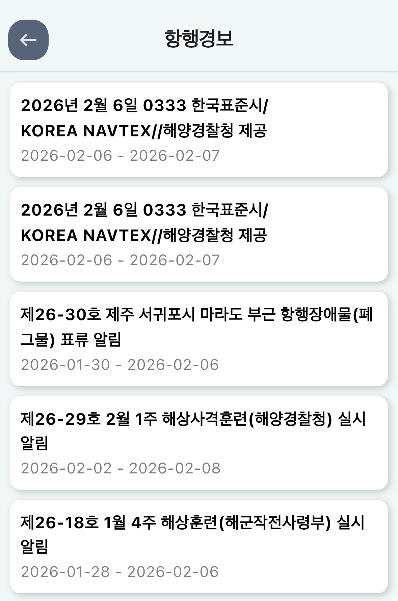

안녕하세요! 오늘은 요트 항해의 핵심인 **'항해 계획(Passage Planning)'**을 이야기해보려 합니다. 거창한 이론 대신, 우리가 익숙한 자동차 여행에 비유해 아주 쉽게 풀어보겠습니다.

## 🚗 항해계획의 4단계 원칙: A-P-E-M

### Appraisal (평가): "내 차로 강원도까지 갈 수 있을까?"

여행 전 목적지 위치를 네비로 찾아보며 내 차의 상태와 도로 상황을 확인하듯, 항로의 수심, 위험물, 내 요트의 정비 상태를 수집하고 **"이 항해가 가능한가?"**를 객관적으로 판단하는 단계입니다.

### Planning (계획): "어디서 쉬고, 기름은 어디서 넣지?"

평가된 정보를 바탕으로 구체적인 경로를 짭니다. 조류와 물때에 맞춘 출발 시각, 비상시 대피할 피항지, 연료와 식료품 계산까지. 수치화된 모든 것을 기록하는 단계입니다.

### Execution (실행): "출발! 그런데 예기치 못한 정체가?"

계획대로 출항을 합니다. 하지만 바다는 늘 변수가 있죠. 갑작스러운 안개나 장비 고장 등 현장 상황에 맞춰 배를 모는 실제 행동 단계입니다.

### Monitoring (감시): "네비게이션의 무한 루프"

운전 중 네비가 "사고 발생, 우회하세요"라고 하듯, 항해 중에도 내 위치를 끊임없이 확인해야 합니다. 새로운 정보가 들어오면 다시 '계획(Planning)' 단계로 돌아가 경로를 수정하는 무한 반복 과정입니다.

---

## ⚓ 선장의 실무 팁: "해도를 100% 믿지 마라"

초대형원유선 선장으로 상선에 승선해 **싱가포르 해협을 통과(Transit)**할 때의 일입니다. 당시 항로상 수심이 가장 낮은 구간에서 컨테이너선 좌초 사고가 있었습니다.

놀라운 점은, 제가 울산에서 하역을 마치고 다시 그곳을 통과하기까지 약 20일이 지났음에도 불구하고 해도(Chart)가 업데이트되지 않았다는 것입니다. 대형 상선에서는 **나브텍스(NAVTEX)**나 **EGC 메시지**를 통해 실시간 항행 경보를 받지만, 요트에서는 장비 특성상 확인이 어렵죠.

그래서 요트 선장님들께 드리는 꿀팁: 출항 전 스마트폰 앱 **'바다네비'**의 항행 경보를 반드시 확인하십시오. 비록 한국 연안 중심이지만, 해도에 반영되지 않은 최신 사고나 장애물 정보를 얻는 데 최고입니다.

기억하십시오. 해도는 과거의 기록일 뿐입니다. 최신 정보를 항해 계획에 반영하는 것, 그것이 안전한 세일링의 시작입니다.

> **참고:** 이 포스팅과 관련된 **요트용 항해 계획표(Passage Plan Template)** 도 첨부합니다. 참조해서 본인만의 항해계획을 작성해보세요.
> [항해계획표 다운로드 (.pdf)](Passage%20Planning.pdf)
