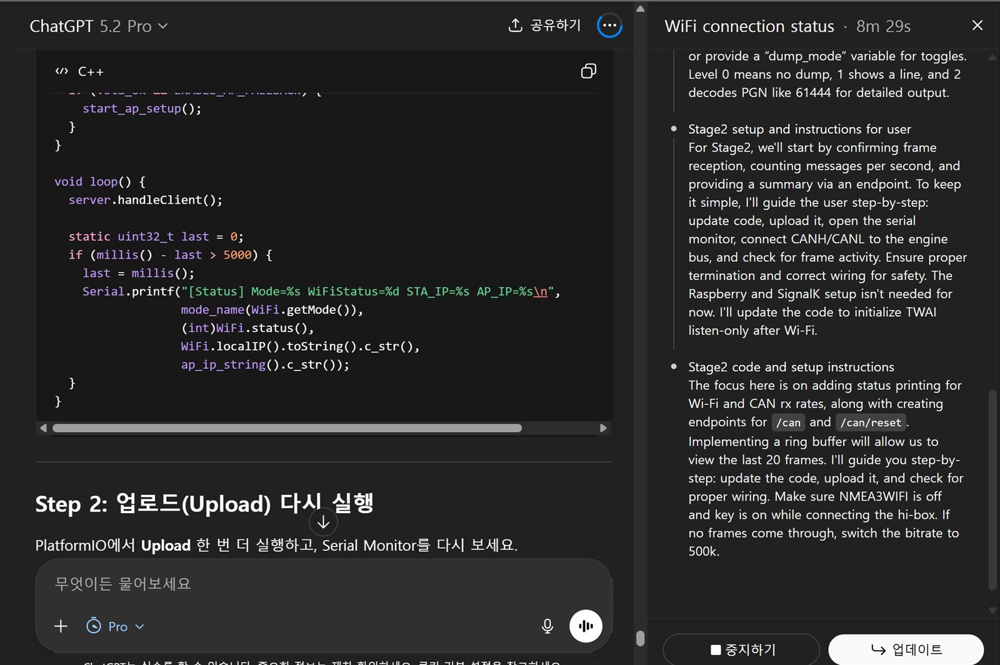
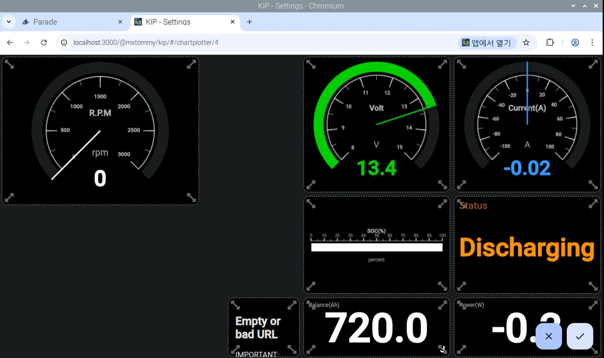
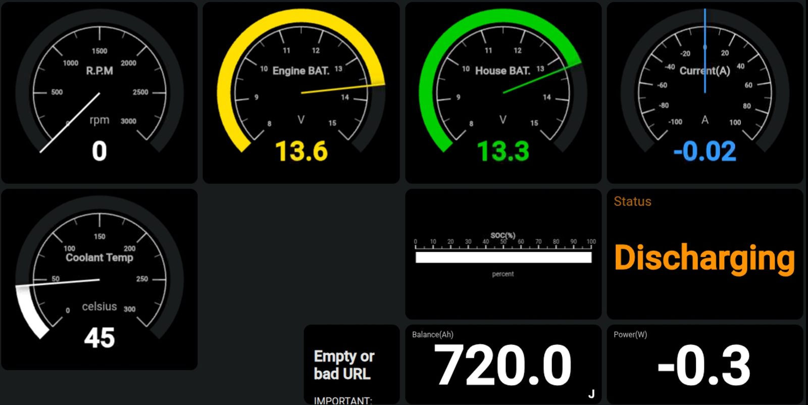
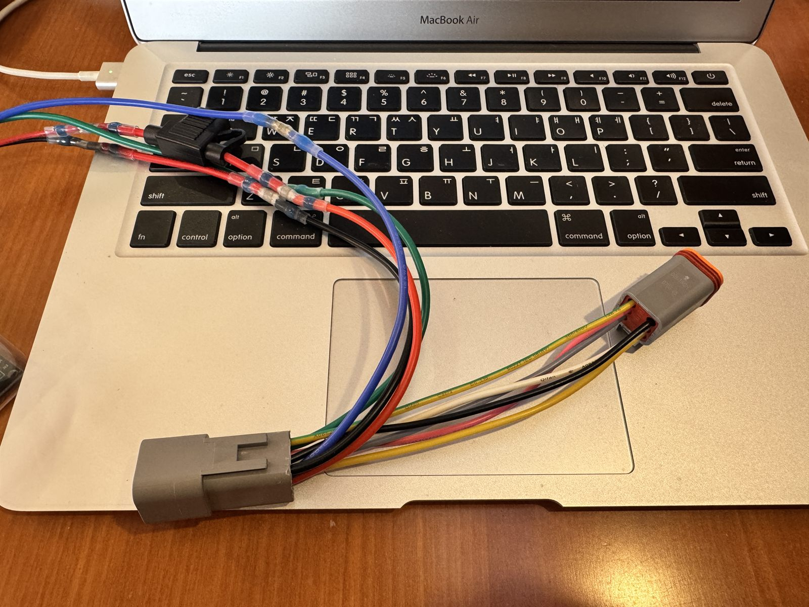
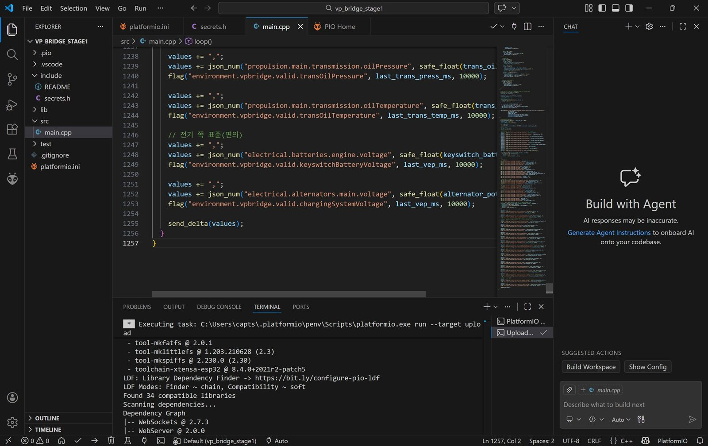
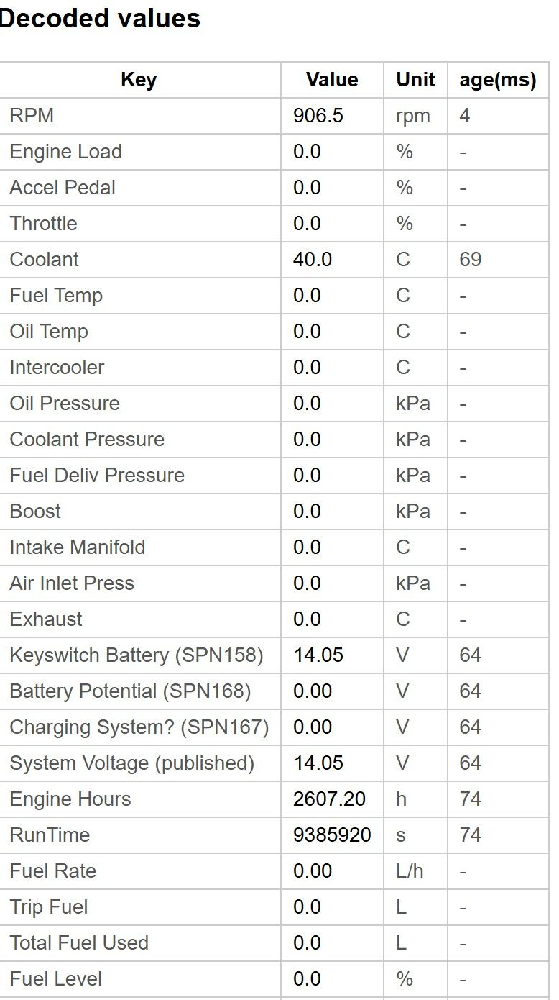

---
title: "볼보 펜타 EVC SignalK 연결 2편: IP 충돌 복구 실전기"
date: 2026-03-02T09:30:00+09:00
description: "마이요트 실전기: 볼보 펜타 EVC를 ESP32(TWAI)로 받아 SignalK·KIP에 연결하고, IP 충돌 사고를 복구한 현장 디버깅 기록."
keywords:
  - "마이요트"
  - "제부도요트"
  - "볼보 펜타 EVC"
  - "ESP32 TWAI"
  - "SignalK"
  - "OpenPlotter"
  - "J1939"
categories:
  - "Marine Electronics"
  - "DIY"
cover:
  image: "kip-fullscreen.jpg"
  alt: "볼보 펜타 EVC 엔진 데이터를 SignalK KIP 대시보드로 표시한 실사용 화면"
  caption: "IP 충돌 사고를 복구하고 완성한 콕핏 엔진 대시보드"
author: "Captain Lima"
draft: false
---

이 글은 이전글 **[볼보 펜타 D2-55 EVC 엔진 정보 훔치기]()** 에서 이어지는 2편입니다.

1편에서 하드웨어를 만들고 기본 수신까지 확인한 뒤, 실사용 전에 마지막 검증을 진행했습니다. 원래는 바로 마무리할 생각이었는데, 더치 6핀 분기 하네스로 결선을 바꾸는 과정에서 네트워크 충돌 사고를 한 번 크게 겪었습니다.

제 요트에는 ESP32 기반 오토파일럿 **멀티플렉서** 가 있는데, 프로젝트용 ESP32와 AP 주소가 겹치면서 IP 충돌이 났고 RAYMARINE 항해기기(TRIDATA) 리셋까지 발생했습니다. 결국 출항해서 배를 2바퀴 돌리는 칼리브레이션을 다시 하고 AP를 완전히 끄는 방식으로 구조를 바꾼 뒤에야 안정화에 성공했습니다.

이번 글에서는 **챗지피티** 와 함께 디버깅 루프를 줄이면서, 실제로 성공한 흐름만 단계별로 정리해 보겠습니다. (제미나이에서 챗지피티로 바뀐 이유는 챗지피티 프로(29만원)를 저렴한 가격으로 구매할 수 있었기 때문입니다.)

## SignalK 와 KIP 를 먼저 간단히 정리

이번 프로젝트의 최종 목적지는 `SignalK` 였습니다. SignalK 는 요트 안의 여러 데이터를 표준 경로(JSON)로 모아 주는 데이터 허브입니다. 센서 종류가 달라도 한곳에서 읽기 좋게 정리해 주기 때문에, 실전에서는 이 통합 구조가 생각보다 큰 차이를 만듭니다.

그리고 `KIP` 는 SignalK 에서 인앱으로 제공되는 대시보드 앱인데, 제가 써본 구성 중에서 실전성이 가장 좋았습니다. 사진처럼 위젯 레이아웃을 마음대로 조절할 수 있고, 페이지를 여러 개 만들어 상하 스와이프로 빠르게 전환할 수 있어서 조타 중 확인할 때 특히 편했습니다.

저는 화면을 아래 4개로 나눠 운영하고 있습니다.

1. 세일링 시 풍향/풍속
2. 엔진 및 배터리 데이터
3. 해도 및 오토파일럿 컨트롤
4. 레이싱용 화면(VMG, Tacking Point 계산)

## 이번에 실제로 달성한 목표

- **Volvo Penta D2-55 EVC의 VP-CAN(J1939) 데이터 수집**
- **ESP32(내장 TWAI) + SN65HVD230(VP230)로 CAN 수신**
- **Wi-Fi로 OpenPlotter/SignalK(라즈베리파이) 서버 전송**
- **SignalK 앱(KIP)에서 RPM, 온도, 전압, 엔진 시간 시각화**

## 먼저 기록할 사고와 리스크

풍향계 공장초기화 이후 엔진 계통까지 문제 생기면 큰일이기 때문에, 챗지피티 프로모드로 전환한 뒤 아래 3가지를 특히 엄격하게 지켰습니다.

1. **AP 사용 금지(또는 최소화), 192.168.4.1 절대 사용 금지**
2. **CAN은 LISTEN-ONLY 고정(엔진 네트워크 송신 금지)**
3. **SignalK 전송은 유니캐스트/화이트리스트 중심**

## 하드웨어 구성과 확정 배선

- ESP32 DevKit(30핀) + 브레이크아웃(터미널) 보드
- VP230(SN65HVD230) CAN 트랜시버 보드(3.3V)
- 엔진 커넥터(더치 6핀) 하네스로 전원+CAN 동시 인입
- VP230 VCC -> ESP32 3V3
- VP230 GND -> ESP32 GND
- VP230 TX(CTX) -> ESP32 GPIO17
- VP230 RX(CRX) -> ESP32 GPIO16
- VP230 CANH/CANL -> 엔진 VP-CAN High/Low

결선 자체는 단순하지만, 아래 4가지는 **반드시** 지켜야 합니다.

- **VP230에 5V 입력 금지** (3.3V 전용)
- **GPIO0/2/12/15 부트 스트랩 핀 회피**
- **엔진 CAN에 종단저항 추가 금지**
- 초기 테스트 중 멀티플렉서/항해기기 전원 OFF 권장

## 개발 환경

- Windows + VS Code + PlatformIO
- 장치 관리자에서 COM 포트 확인
- 업로드 포트 busy 시 Serial Monitor 종료 후 업로드

## Stage1: 네트워크부터 안전하게 잠그기

처음에는 CAN 이 아니라 네트워크부터 잡았습니다. 목표는 딱 하나, `192.168.4.1` 이 어떤 상황에서도 다시 뜨지 않게 막는 것이었습니다.

- 내가 한 조치: **ESP32를 STA 모드로만** 붙이고 AP 비활성화, AP 표시도 OFF
- 성공 판단 기준: **`STA IP: 192.168.1.106`, `AP IP: OFF`**
- 실수 포인트: 기본 AP를 켠 채 테스트를 시작하면 기존 항해 네트워크와 충돌 위험

## Stage2: CAN 수신 확인(LISTEN-ONLY)

네트워크를 잠갔으면 그다음은 CAN 입니다. 이 단계에서는 절대 무리하지 않고 LISTEN-ONLY 로 수신만 확인했습니다.

- 내가 한 조치: **TWAI LISTEN-ONLY + 250kbps** 설정, 프레임 덤프/frames per second로 1차 확인
- 성공 판단 기준: **PGN 61444(EEC1) 반복 수신** 로그 확인 (`pgn=61444 dlc=8 data=...`)
- 실수 포인트: 송신 모드/속도 오설정은 불필요한 버스 에러와 위험으로 연결

## Stage3-A: SignalK 연결 안정화(토큰/WS)

처음에는 WebSocket 이 CONNECTED 됐다가 바로 DISCONNECTED 되는 구간이 반복됐습니다. 이때 서버 문제인지, 인증 문제인지, CAN 문제인지가 한꺼번에 섞이면 디버깅 시간이 끝없이 늘어납니다.
차트 테이블에서 뒷방 구석까지 몇번을 왕복했는지 모릅니다. ㅜㅜ

- 내가 한 조치: SignalK `192.168.1.100:3000` 기준 토큰 적용, 토큰 전달 방식을 **`?token=` 쿼리**로 정리
- 성공 판단 기준: **SignalK hello 메시지 수신**, **heartbeat 값 생성**
- 실수 포인트: 헤더 방식에서 CONNECTED 후 DISCONNECTED 반복되는 경우가 있었음

## Stage3-B: 엔진 값 파싱 후 표준 키 매핑

연결이 안정화되면 그때부터 엔진 값을 하나씩 매핑했습니다. 여기서 핵심은 "연결 성공"과 "파싱 성공"을 분리해서 보는 것입니다.

- 내가 한 조치: 아래 PGN 파싱 후 표준 키 매핑
- 성공 판단 기준: **KIP 및 API 경로에서 값 생성/갱신 확인**
- 실수 포인트: 서버 연결 성공과 엔진 파싱 성공은 별개이므로 분리 진단 필수

파싱/매핑한 항목은 아래와 같습니다.

- PGN 61444 -> RPM
- PGN 65262 -> 냉각수온
- PGN 65271 -> 알터네이터 전압
- PGN 65253 -> 엔진 시간
- 진단 키(`environment.vpbridge.*`): heartbeat, canFramesPerSecond, busErrorCount, rxErrorCounter, twaiState, lastCanPgn, lastCanIdHex

## 브라우저에서 바로 확인한 API 경로

- `http://192.168.1.100:3000/signalk/v1/api/vessels/self/environment/vpbridge/heartbeat`
- `http://192.168.1.100:3000/signalk/v1/api/vessels/self/environment/vpbridge/canFramesPerSecond`
- `http://192.168.1.100:3000/signalk/v1/api/vessels/self/environment/vpbridge/busErrorCount`
- `http://192.168.1.100:3000/signalk/v1/api/vessels/self/propulsion/main/revolutions`
- `http://192.168.1.100:3000/signalk/v1/api/vessels/self/propulsion/main/coolantTemperature`
- `http://192.168.1.100:3000/signalk/v1/api/vessels/self/propulsion/main/alternatorVoltage`
- `http://192.168.1.100:3000/signalk/v1/api/vessels/self/propulsion/main/runTime`

현장에서는 시리얼 콘솔을 계속 보는 것보다, 위 주소를 브라우저에서 직접 열어 **값 생성/갱신 여부를 확인하는 방식**이 훨씬 빨랐습니다.

## 마무리: 이번 프로젝트에서 얻은 교훈

마지막으로, 이번에 가장 크게 느낀 건 **엔진 상태를 실시간으로 보는 것의 가치** 였습니다.

Volvo Penta 운용 매뉴얼에서도 냉각수온 경고가 뜨면 즉시 엔진 정지를 지시하고, 점검 항목으로 **해수 필터 막힘** 과 **해수펌프 임펠러** 를 바로 확인하라고 안내합니다. 즉, 냉각수온은 단순 숫자가 아니라 해수 냉각계통 상태를 알려주는 핵심 신호라는 뜻입니다.

- **쿨링워터펌프(임펠러) 이상 징후를 가장 먼저 잡을 수 있습니다.** 임펠러가 닳거나 손상되면 유량이 먼저 떨어지고, 그 변화가 냉각수온 상승으로 빠르게 나타납니다.
- **세일드라이브 해수 유입 라인 막힘을 조기에 알아차릴 수 있습니다.** 해수 유입구/씨스트레이너가 부분적으로 막혀도 온도 추세가 먼저 흔들리기 때문에, 완전 과열 전에 대응할 시간이 생깁니다.
- **경고등이 뜬 뒤가 아니라, 뜨기 전에 대응할 수 있습니다.** 대시보드에서 온도 추세를 보면 스로틀 조정, 항로 변경, 즉시 점검 판단이 훨씬 빨라집니다.
- **결국 큰 고장 비용을 줄입니다.** 과열 상태 지속은 엔진에 치명적일 수 있어서, 냉각수온 모니터링은 사실상 가장 가성비 좋은 엔진 보호 장치입니다.

그리고 콕핏에서 **엔진 배터리 전압을 실시간으로 보는 것**도 체감상 정말 큽니다.

- **시동 실패를 미리 예방할 수 있습니다.** 출항 전에 전압 상태를 바로 확인하니 "키 돌려보고 나서" 문제가 드러나는 일을 줄일 수 있습니다.
- **충전계통 이상을 조기에 잡아낼 수 있습니다.** 운전 중 전압이 정상적으로 올라오지 않으면 알터네이터/벨트/배선 상태를 바로 의심해 볼 수 있습니다.
- **접촉 불량이나 전압 강하를 빨리 감지할 수 있습니다.** 터미널 풀림이나 노후 배선은 숫자가 먼저 흔들리기 때문에, 고장으로 번지기 전에 점검 타이밍을 잡기 좋습니다.
- **세일링 중 배터리 방전으로 재시동이 안 될까 걱정되던 두려움, 이제는 안녕하셔도 됩니다.** 콕핏에서 전압을 실시간으로 확인할 수 있으니 엔진 배터리 상태를 미리 파악하고 여유 있게 대응할 수 있습니다.

***챗지피티 프로(29만원)은 제미나이 프로(2.9만원)보다 10배 더 좋다고 느꼈습니다.*** **(개인 체감 ㅋㅋ)**

### 📚 함께 읽으면 좋은 글

- **[볼보 펜타 D2-55 EVC 엔진 정보 훔치기]()**: 이번 글의 1편으로, 하드웨어 제작과 초기 수신 준비 과정을 다룹니다.
- **[상용 플로터를 넘어서: OpenPlotter와 MacArthur HAT으로 나만의 통합 항해 시스템 만들기]()**: SignalK 기반 통합 항해 시스템 확장에 도움이 됩니다.
- **[4만원으로 요트 전력 관리 시스템 구축하기: KM110F 해킹 & OpenPlotter 연동]()**: 저비용 센서 데이터 통합 사례를 함께 볼 수 있습니다.

**Bon Voyage!**
