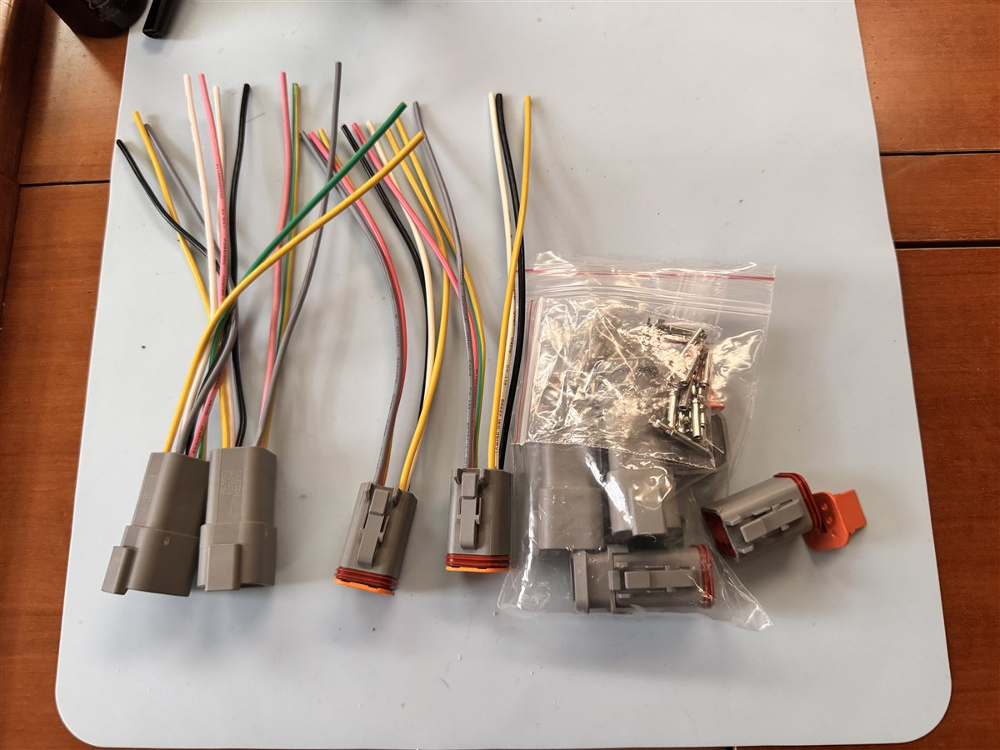
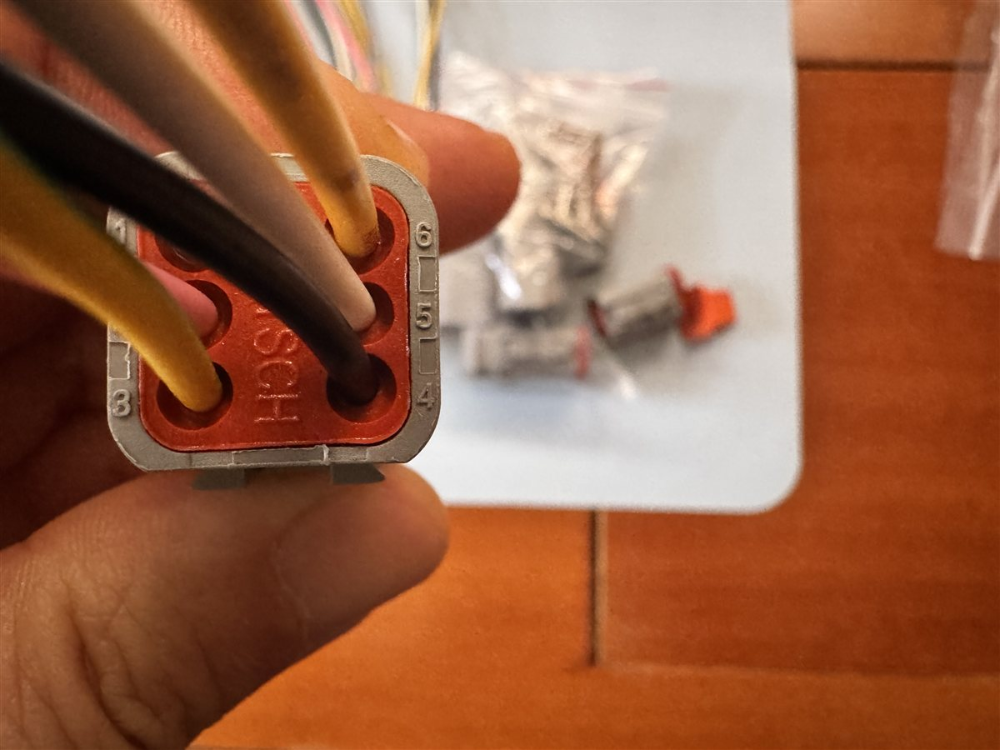
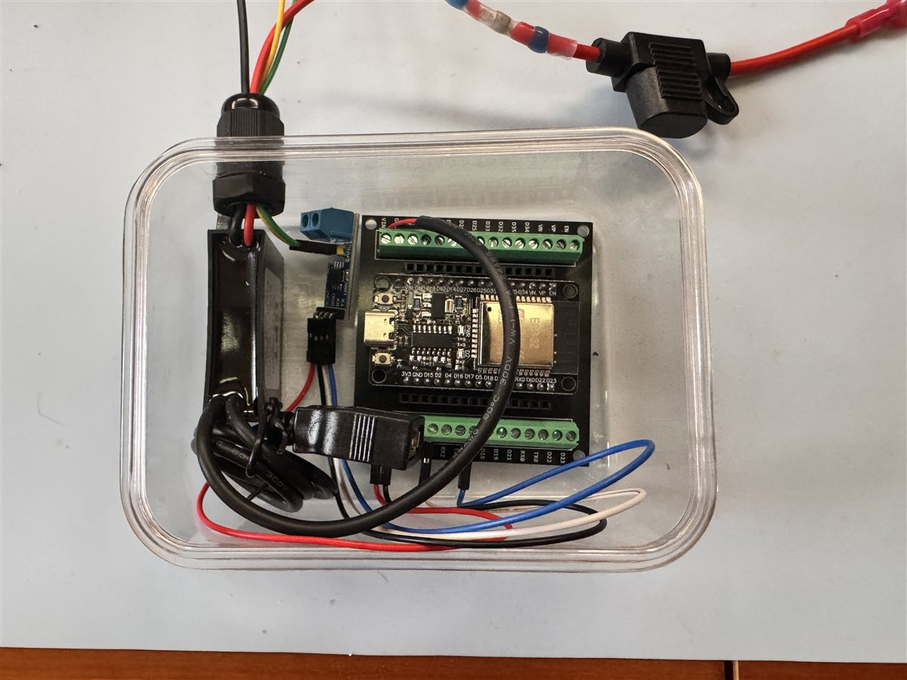
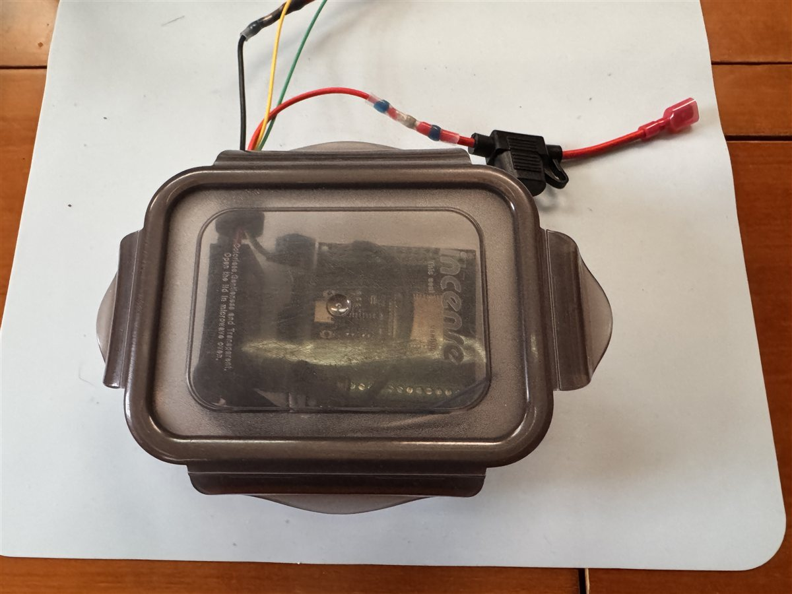

볼보 펜타 엔진 데이터를 모니터링하려면 정품 게이트웨이나 비싼 NMEA 2000 변환기를 사야 합니다. 가격을 알아보니 음~ 소리가 절로 나오더라고요. 물론 제배는 NMEA 2000 백본케이블도 없습니다. 그래서 직접 만들어보기로 했습니다 ㅜㅜ.

**약 4만원 안쪽**이면 충분합니다.

지금부터 제가 시도한 방법을 공유해 드릴게요.

### 예상 비용

* **6핀 더치 케이블**: 약 1만원
* **ESP32**: 약 1만원
* **VP230 CAN 모듈**: 약 5천원
* **스텝다운 컨버터**: 약 5천원
* **기타 부자재**: 약 1만원

---

## 1. 더치 6핀 케이블 구매

가장 먼저 엔진의 진단 포트(Diagnostic Port)에 맞는 케이블을 구해야 합니다. 볼보 D2-55 엔진은 6핀 'Deutsch' 커넥터를 사용합니다. 알리익스프레스나 국내 전자부품 쇼핑몰에서 쉽게 구할 수 있습니다.



---

## 2. 핀번호 확인 (직접 확인 필수)

인터넷에 핀맵 정보가 돌아다니지만, 그대로 믿으면 안 됩니다. 배마다 배선이 다를 수 있거든요. 저는 멀티미터로 하나하나 찍어보며 확인했습니다.

* <strong>전원(12V)</strong>과 <strong>그라운드(GND)</strong> 위치 확인 (제경우 6번과 4번)
* <strong>CAN High</strong>와 <strong>CAN Low</strong> 식별 (제경우 5번과 2번)

자칫하면 보드를 태워 먹을 수 있으니, 꼭 직접 찍어보고 확인하세요.



---

## 3. 하이박스 제작 및 연결

핀 번호를 확인했다면 이제 ESP32와 연결할 하이박스를 만듭니다. 진동이 많은 엔진룸 환경을 고려해 튼튼하게 납땜하고 수축 튜브로 마감했습니다. 시동시 전원이 튈까봐 퓨즈도 하나 달았어요.



---

## 4. 하드웨어 구성 (ESP32 + VP230 + 스텝다운)

핵심 부품들을 연결할 차례입니다.

* **ESP32**: 두뇌 역할 (와이파이 블루투스 내장)
* **VP230**: 엔진의 CAN 신호를 ESP32가 이해할 수 있게 변환
* **스텝다운 컨버터**: 엔진 전원(12V~14V)을 ESP32 구동 전압(5V)으로 낮춤

작은 락앤락통에 오밀조밀 배치했습니다.



---

## 5. 코딩 (제미나이 도움 받기)

솔직히 코딩은 1도 모릅니다. CAN 통신 프로토콜을 다 이해하려니 머리가 아프더라고요.

그래서 **제미나이**에게 도움을 요청했습니다.
"볼보 펜타 엔진의 CAN 데이터를 읽어서 시그널케이에 뿌려주는 코드를 짜줘."

놀랍게도 꽤 그럴듯한 코드를 짜주더군요. 몇 번의 수정 끝에 기본적인 수신 코드를 완성했습니다.

```cpp
#include <Arduino.h>
#include <ESP32-TWAI-CAN.hpp>

// 기본 CAN 수신 설정
void setup() {
    Serial.begin(115200);
    Can.setPins(4, 5); // RX, TX 핀 설정
    Can.begin(250000); // 볼보 펜타 통신 속도 250kbps
}

void loop() {
    CanFrame rxFrame;
    if (Can.read(rxFrame)) {
        Serial.printf("ID: %X Data: ", rxFrame.identifier);
        for (int i = 0; i < rxFrame.data_length_code; i++) {
            Serial.printf("%02X ", rxFrame.data[i]);
        }
        Serial.println();
    }
}
```

---

## 6. 와이파이 연결

데이터가 들어오는 걸 확인했으니, 이제 무선으로 쏴줄 차례입니다. ESP32의 강력한 기능인 와이파이를 활용했습니다.

엔진룸에 스마트폰을 들고 갈 필요 없이, 살롱이나 조타석에서도 엔진 상태를 볼 수 있게 말이죠. Signal K 서버로 데이터를 보내는 것까지 성공했습니다.

---

## 7. 실제 데이터 확인 (다음 편에 계속)

연결하고 시동을 켜는 순간, 화면에 숫자들이 쏟아지더군요.
**RPM, 엔진가동시간, 배터리 전압...**

이 감동적인 순간과 실제 데이터 해석 방법은 2부에서 자세히 다루겠습니다.

---

## 마치며

이 작업은 엔진을 개조하는 게 아닙니다. 이미 엔진 내부에서 흐르고 있는 데이터를 <strong>"조용히 듣는 것(Sniffing)"</strong>에 가깝습니다.

물론 약간의 납땜 실력과 시행착오는 필요합니다. 하지만 30~40만 원이 넘는 장비를 단돈 5만 원에 직접 구현했을 때의 성취감은 정말 짜릿합니다. 전 세계 요트인들이 왜 이 방식에 열광하는지 알겠더군요. 특히 무선으로 콕핏이든 선수에서든 태블릿, 폰, 워치로 데이터를 볼 수 있다는 점이 정말 매력적입니다.

특히 코딩을 하나도 모르는 저도 AI를 이용해서 바이브 코딩을 하는것 만으로 하나씩 지식이 쌓여가는 성취감은 상당히 짜릿합니다.

마이요트 가족분들의 안전항해를 항상 기원합니다. 새해 복 많이 받으세요.

### 📚 함께 읽으면 좋은 글

* **[상용 플로터를 넘어서: OpenPlotter와 MacArthur HAT으로 나만의 통합 항해 시스템 만들기]()**: 엔진 데이터와 배터리, AIS까지 모든 것을 통합하여 관리하는 법을 소개합니다.
* **[4만원으로 요트 전력 관리 시스템 구축하기: KM110F 해킹 & OpenPlotter 연동]()**: 저렴한 비용으로 구축하는 또 다른 가성비 DIY 프로젝트입니다.

**Bon Voyage!**
