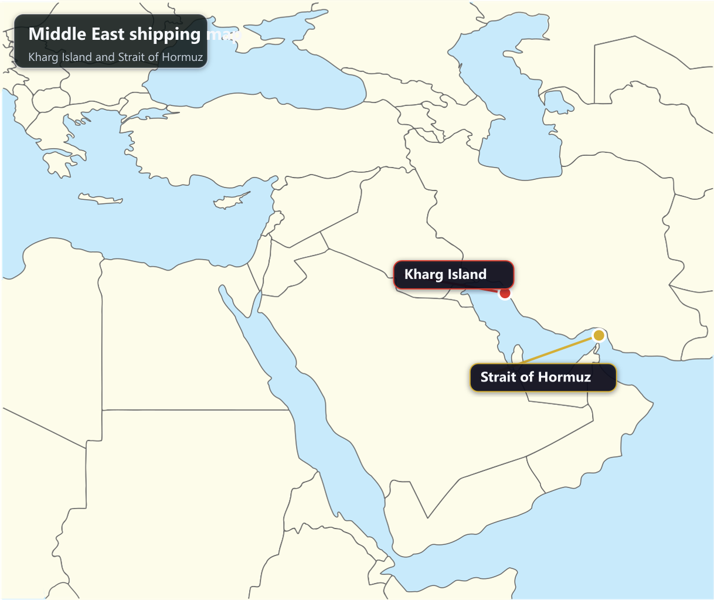
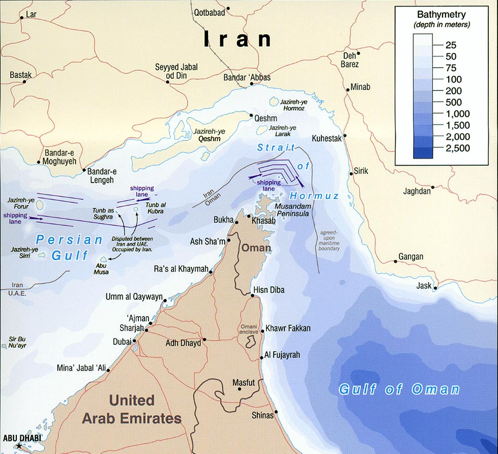

연일 멀리서 들려오는 전쟁 이야기로 시끄럽습니다. 그런데 제게는 그 뉴스가 남의 나라 지도 위 점 몇 개로 보이지 않습니다. **호르무즈 해협**, **반다르아바스(Bandar Abbas)**, 그리고 **하르크섬(Kharg Island, 흔히 Khark Island라고도 적습니다)** 같은 이름이 제가 승선 중 실제로 오가던 항로와 기항지의 기억을 먼저 끌어올리기 때문입니다.

그래서 저는 이번 전쟁 뉴스를 국제정치 기사로만 읽지 못하겠습니다. 항만 하나가 흔들리면 결국 그 안에서 일하는 파일럿, 선원, 통관 실무자, 현지 가족들이 먼저 다칩니다. 어렵게 쌓아 올린 나라의 이미지도 한순간에 뒤집힐 수 있습니다.

## 짧은 결론부터

제 생각은 단순합니다. 전쟁이 길어질수록 제일 먼저 소모되는 건 명분이 아니라 사람입니다. 특히 바다에서는 더 그렇습니다. 항로가 흔들리면 보험료가 오르고, 검사가 까다로워지고, 이유 없는 지연과 긴장이 늘고, 결국 먼저 닳아 나가는 건 사람입니다.

그래서 저는 어느 편의 논리보다 먼저, **평화로운 세상**과 **선원들의 무사 귀항**을 말하고 싶습니다. 항만이 조용해야 선원도, 그 가족도 비로소 숨을 쉽니다.

## 반다르아바스와 하르크섬은 제게 뉴스 속 지명이 아니었습니다

예전 상선 시절을 떠올리면, 이 이름들은 지명보다 냄새와 온도로 먼저 기억납니다. 반다르아바스는 그 특유의 열기와 습도로, 하르크섬은 유조선 실무자라면 긴장감을 늦추기 어려운 곳으로 남아 있습니다. 그리고 반다르아바스는 제게 아직도 **살면서 먹어본 가장 맛있는 파인애플의 기억으로 남아 있는 항구** 입니다. 제가 예전에 적었던 **[상선 일기: 대양 위 336미터의 고독과 새우 파티]()** 처럼, 배에서 오래 보낸 사람에게 항구 이름은 단순한 지명이 아니라 사람과 분위기, 일의 리듬이 한데 붙어 있는 기억입니다.

그래서 이런 지명은 더 조심해서 부르게 됩니다. 항만과 도시 이름은 **Bandar Abbas** 라는 표기가 가장 익숙하고, 항만 단위로는 **Bandar Abbas Port** 라는 이름도 함께 씁니다. 하르크섬 역시 영문 자료에서는 **Kharg Island** 와 **Khark Island** 가 함께 쓰입니다.

*▲ 중동 전체 지도 위에 Kharg Island와 Strait of Hormuz 위치를 함께 표시했습니다.*

## 1999년 무렵, 중동 항만에서 제가 느꼈던 한국의 이미지

1999년 전후 중동에 기항하던 시절, 솔직히 말해 한국의 이미지는 썩 좋지 않았습니다. 적어도 제가 현장에서 체감한 분위기는 그랬습니다. 거칠게 윽박지르는 사람도 있었고, 자기 잘못이 아닌데도 남 탓으로 돌리는 실무도 있었고, 정중하게 부탁한 일이 "인샬라" 한마디와 함께 사실상 미뤄져 버리는 경우도 적지 않았습니다.

이건 중동 전체를 한 문장으로 재단하겠다는 이야기가 아닙니다. 어디든 좋은 사람과 거친 사람이 섞여 있습니다. 다만 그 시절 제가 항만 현장에서 받았던 공기는, 한국 선박이나 한국인에게 특별히 따뜻하다고 말하기 어려운 쪽에 더 가까웠습니다.

호르무즈 해협은 원래도 긴장이 높은 곳입니다. 좁고, 바쁘고, 세계 에너지 물동량이 몰리는 길목이라 말 한마디, 검사 하나, 파일럿 보딩 한 번이 모두 예민할 수밖에 없습니다. 그런 곳에서 국적에 대한 인상은 생각보다 크게 작동합니다.

*▲ Strait of Hormuz는 오만과 이란 사이를 잇는 좁은 길목이자, 세계 해상 에너지 물동량에서 매우 민감한 해역입니다.*

> **Captain's Note:** 항만에서 국적의 평판은 여권 한 줄이 아닙니다. 접안 순서, 검사 태도, 현장 대화의 온도로 바로 체감됩니다.

## 대장금 이후, 분명히 공기는 바뀌었습니다

제 기억으로 중동 현장의 눈빛이 조금씩 바뀌기 시작한 건 드라마 **대장금** 이후였습니다. 이란에 기항했을 때 한국말로 먼저 인사하는 사람들을 만나기 시작했고, 중동 전체에서 한국을 보는 시선이 전보다 훨씬 부드러워졌다고 느꼈습니다.

배를 내린 지 벌써 5년 가까이 되어가지만, 마지막 무렵엔 그 변화가 더 분명했습니다. 식사 시간에 김치를 찾는 현지 파일럿이나 관계자도 늘었고, 서툰 한두 마디가 아니라 제법 여러 문장으로 한국말을 하는 사람도 생겼습니다. 지금은 BTS와 한국 콘텐츠의 영향까지 더해졌으니, 제가 마지막으로 배를 타던 때보다 분위기가 더 좋아졌을지도 모르겠습니다.

저는 이런 변화를 가볍게 보지 않습니다. 문화와 친밀감은 하루아침에 쌓이지 않기 때문입니다. 누군가의 작품 하나, 누군가의 예의 있는 대응 하나, 누군가의 성실한 항만 실무가 겹겹이 쌓여서 겨우 '한국 사람은 참 괜찮다'는 인상을 만드는 겁니다.

## 나라 사이가 틀어지면 결국 국민이 먼저 피곤해집니다

나라끼리 사이가 나빠지면 가장 먼저 피해를 받는 건 늘 평범한 사람들입니다. 특히 움직여야 먹고사는 사람, 일정에 맞춰 입항하고 출항해야 하는 사람, 서류 한 장이라도 빨리 통과시켜야 하는 사람이 먼저 지칩니다.

저 역시 중국과 사이가 좋지 않던 시기에 보복성 검사처럼 느껴지는 대응을 당하고, 이유 없는 꼬투리로 실무가 괜히 늘어지는 경험을 여러 번 했습니다. 이런 일은 기사 한 줄로는 작아 보여도, 현장에서는 사람을 아주 피곤하게 만듭니다. 배 한 척, 당직 한 번, 검사 한 차례가 그대로 스트레스로 돌아옵니다.

그래서 저는 남의 나라 전쟁에 한국이 발을 들이는 이야기를 들을 때, 그걸 국제정치의 판으로만 생각하지 못합니다. 오늘은 멀리 있는 이야기처럼 보여도, 내일은 한국 여권을 든 선원, 한국 선적 선박, 한국 기업 실무자에게 그대로 돌아올 수 있기 때문입니다.

실제로 제 기억 속에는, 한국과 이란의 관계가 비교적 좋았기 때문에 큰일을 피했다고 느낀 순간도 있습니다. 이란혁명수비대와 얽힌 위험한 경험이 아예 없었던 것은 아니었고, 그때 저는 국적 하나가 현장에서 사람을 살릴 수도 있겠다는 생각을 했습니다.

## 어렵게 만든 이미지를 전쟁으로 잃고 싶지 않습니다

저는 한국이 어디를 가도 비교적 정중한 대접을 받는 지금의 분위기가 참 아깝습니다. 이건 공짜로 생긴 이미지가 아닙니다. 현장에서 성실하게 일한 사람들, 해외에서 함부로 굴지 않았던 보통의 한국인들, 문화로 먼저 다가간 작품들이 오래 쌓아 올린 결과입니다.

그래서 더더욱, 남의 나라 전쟁에 대한 개입이 그 이미지를 적대감으로 바꾸는 방향으로 흘러가지 않았으면 좋겠습니다. 전쟁은 늘 거창한 명분으로 시작하지만, 현장에 남는 건 불신과 긴장, 그리고 보통 사람들의 피곤함인 경우가 많았습니다.

이 생각은 **[왜 나는 이 블로그를 시작했나]()** 에 적었던 마음과도 닿아 있습니다. 저는 바다에서 사람을 잃게 만드는 건 대개 추상적인 명분이 아니라, 근거 없는 확신과 현실 감각 없는 판단이라고 생각합니다. 이번에도 마찬가지입니다.

## 제가 바라는 건 결국 하나입니다

평화로운 세상이 되었으면 좋겠습니다.  
이 말이 너무 순진하게 들릴지 몰라도, 배를 오래 탄 사람일수록 결국 이 문장으로 돌아오게 됩니다.

항만이 조용해야 선원이 집에 갑니다.  
해협이 열려 있어야 가족이 안심합니다.  
국가 이미지가 좋아야 현장 사람이 덜 다칩니다.

그러니 저는 이번에도 큰 목소리보다 작은 바람을 택하겠습니다.  
**나라와 가족을 위해 최일선에서 봉사하는 선원들의 안전한 귀항을 기원합니다.**

## 참고 자료

- [Bandar Abbas | Britannica](https://www.britannica.com/place/Bandar-e-Abbas)
- [Kharg Island | Britannica](https://www.britannica.com/place/Kharg-Island)
- [Ports and Maritime Organization (PMO) | IAPH](https://www.iaphworldports.org/iaph-md/directory/port_details/61)
- [World Oil Transit Chokepoints - Strait of Hormuz | U.S. EIA](https://www.eia.gov/international/content/analysis/special_topics/World_Oil_Transit_Chokepoints/)
- [Middle East location map2.svg | Wikimedia Commons](https://commons.wikimedia.org/wiki/File:Middle_East_location_map2.svg)
- [Strait of Hormuz 2004.png | Wikimedia Commons](https://commons.wikimedia.org/wiki/File:Strait_of_Hormuz_2004.png)

**Bon Voyage!**

### 📚 함께 읽으면 좋은 글

- **[상선 일기: 대양 위 336미터의 고독과 새우 파티]()**: 상선 시절의 공기와 동료 의식을 조금 더 가까이 보실 수 있습니다.
- **[왜 나는 이 블로그를 시작했나: 바다에서는 틀린 정보가 사람을 잃게 한다]()**: 제가 왜 현장 감각과 책임을 중요하게 보는지 배경을 설명한 글입니다.
- **[[항법 가이드] 제부도 요트, 마이요트 리마 선장이 알려주는 요트 항법]()**: 배 위에서 결국 가장 중요하게 남는 건 사람을 무사히 데려오는 감각이라는 점에서 같이 읽을 만합니다.
