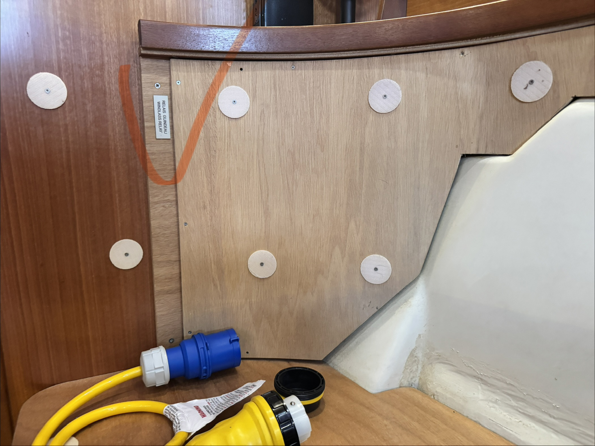
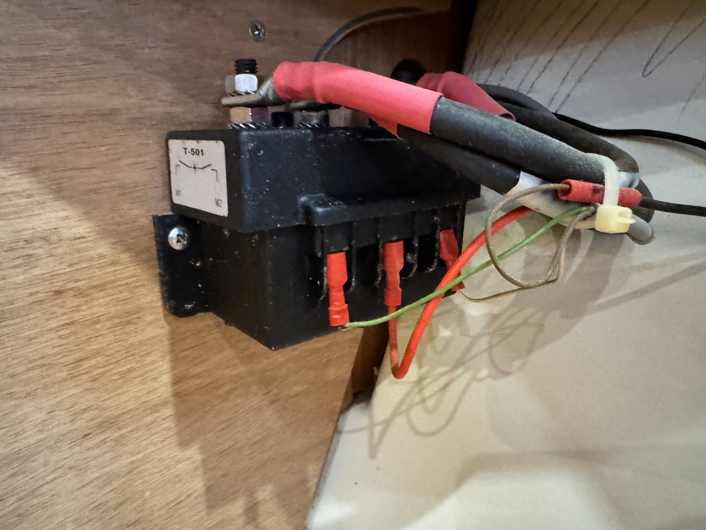
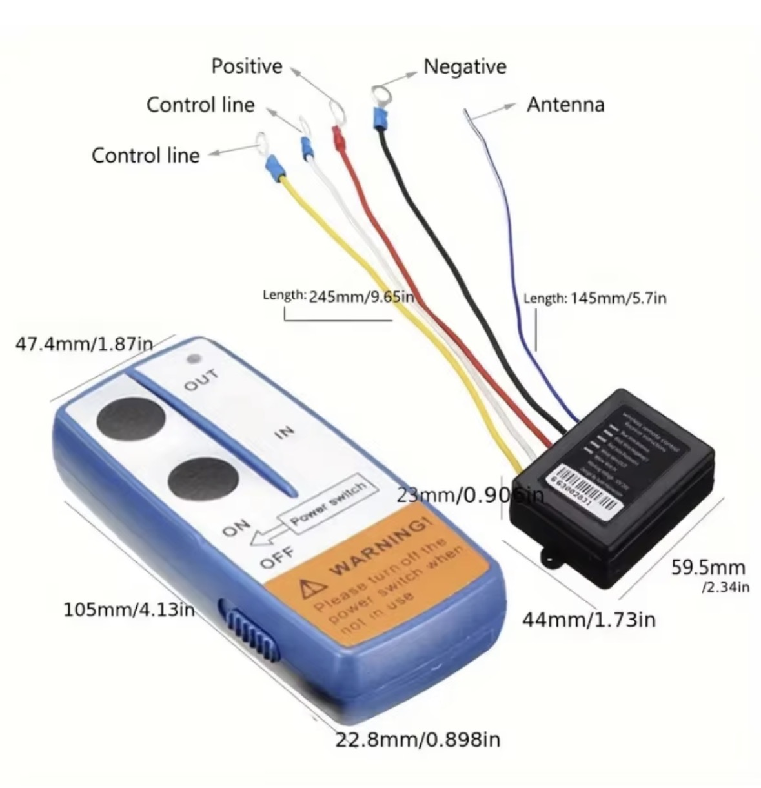
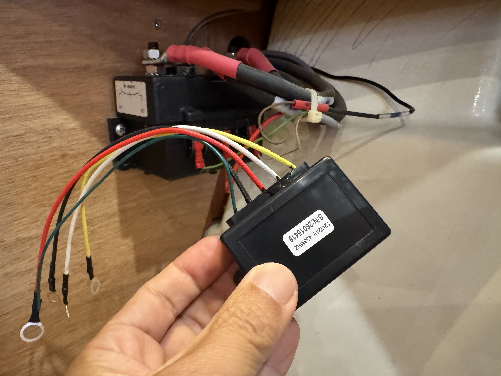
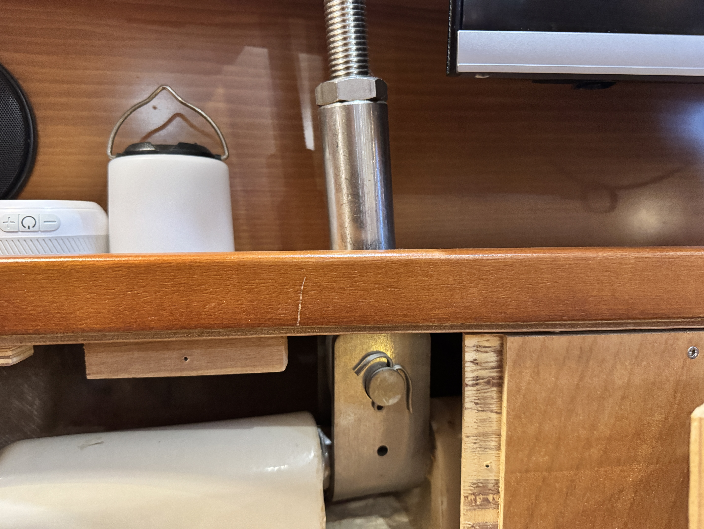

지난번 **[요트 앵커링(Anchoring): 1급 해기사의 대형선 원리 적용과 실전 팁]()** 글에서 예고했던 **윈드라스 무선 리모컨 DIY** 를 이제야 실제로 마무리했습니다. 사실 제품을 산 건 두 달쯤 전인데, 설치가 늦어진 이유는 의외로 단순했습니다. 배선 작업보다 먼저 **윈드라스 솔레노이드 위치** 를 못 찾고 한동안 헤맸기 때문입니다.

처음에는 당연히 **앵커 체인 로커** 쪽 어딘가에 있을 줄 알고 선수 쪽을 한참 뒤졌습니다. 그런데 아무리 찾아도 안 보여서 결국 **듀포(Dufour) 포럼** 을 뒤졌고, 거기서 제 배와 비슷한 구조의 글을 보고서야 스위치가 **스타보드 소파 안쪽** 에 숨어 있다는 걸 알게 됐습니다. 실제로 접근하려면 피스를 여덟 개쯤 풀어야 했고, 그제야 겨우 솔레노이드를 눈으로 확인할 수 있었습니다.

이번 글은 그렇게 숨어 있던 솔레노이드를 찾아 **윈드라스 무선 리모컨** 을 붙인 기록입니다. 다만 결론은 처음 생각했던 "유선과 무선 병렬 운용"이 아니라, 제 배 배선 방식에 맞춰 **기존 유선 리모컨은 포기하고 무선으로 정리한 과정** 에 더 가까웠습니다. 배마다 구조와 극성이 다르니, 이 부분은 결국 직접 열어보고 실측하는 수밖에 없었습니다.

## 먼저 요약하면

* **윈드라스 솔레노이드 위치** 는 선수 체인 로커가 아니라 **스타보드 소파 안쪽** 이었습니다.
* 안에서 확인한 부품은 **T-501 솔레노이드** 였습니다.
* 알리익스프레스에서 산 저가형 무선 수신기는 **마이너스(-) 제어**, 제 배의 윈드라스는 **플러스(+) 제어** 라서 병렬 사용은 포기했습니다.
* 결국 이번 작업은 유선과 무선을 같이 쓰는 개조가 아니라, **기존 유선 리모컨을 접고 무선으로 정리한 기록** 이 됐습니다.

## 왜 무선 리모컨이 필요했나

앵커링은 생각보다 손이 많이 갑니다. 선수에서 체인 상태를 보고, 다시 조작 위치로 이동하고, 또 다시 선수 쪽을 확인하는 흐름이 반복되기 때문입니다. 혼자 탈 때도 번거롭지만, 4시간 투어처럼 손님과 함께 있을 때는 이 순간이 더 바빠집니다. 손님들은 잠깐의 정박으로 느끼겠지만, 선장 입장에서는 체인 상태와 배의 자세, 주변 거리까지 한꺼번에 봐야 하는 구간이기 때문입니다.

그래서 제가 원했던 건 멀리서 버튼을 누르는 재미가 아니라, **체인이 보이는 자리에서 바로 조작할 수 있는 여유** 였습니다. 무선 리모컨은 그 점에서 꽤 매력적인 선택지였습니다.

## 윈드라스 솔레노이드는 어디에 있었나

이번에 사용한 건 알리익스프레스에서 구한 흔한 **2채널 무선 릴레이 수신기** 타입이었습니다. 가격은 1만원이 채 안 됐고, 송신기와 작은 수신기 박스로 구성된 전형적인 제품입니다. 그런데 정작 설치보다 먼저 막힌 건 "이걸 어디에 물릴 것인가"였습니다.

처음에는 당연히 앵커 체인 로커 쪽 어딘가에 있을 거라고 생각했습니다. 그래서 선수 쪽을 한참 뒤졌는데도 안 보여서, 결국 듀포 포럼을 다시 뒤졌습니다. 거기서 제 배와 비슷한 구조의 글을 보고서야 스타보드 소파 안쪽을 열어봐야 한다는 힌트를 얻었습니다. 실제로는 피스를 여덟 개쯤 풀어야 했고, 그제야 작업 공간이 열렸습니다.

*▲ 제 경우 솔레노이드는 선수 로커가 아니라 스타보드 소파 안쪽에 있었습니다. 위치를 모르고 있던 두 달 동안 설치가 계속 밀린 이유도 결국 이것이었습니다.*

패널 안쪽을 더 따라가 보니, 제가 찾고 있던 부품은 **T-501 솔레노이드** 였습니다. 윈드라스의 올림과 내림 방향 전환을 맡는 핵심 부품이었고, 결국 이번 작업은 이 부품을 찾은 뒤에야 비로소 다음 단계로 넘어갈 수 있었습니다.

*▲ 스타보드 소파 안쪽에서 찾은 T-501 솔레노이드입니다. 무선 리모컨을 달든 기존 유선을 손보든, 결국 이 구조를 이해해야 다음 판단이 가능합니다.*

## 왜 병렬 사용을 포기했나

처음 목표는 명확했습니다. **기존 유선 리모컨과 무선 리모컨을 병렬로 같이 쓰는 것** 이었습니다. 그런데 T-501을 기준으로 배선을 따라가 보니, 제 배의 솔레노이드 스위치는 **플러스(+)를 주는 방식** 이었고, 제가 구입한 무선 수신기는 **마이너스(-)를 주는 방식** 이었습니다.

즉, 제가 처음 생각했던 것처럼 같은 입력에 무선 모듈을 단순 병렬로 붙이는 방식은 맞지 않았습니다. 추가 릴레이나 신호 변환을 더 넣어서 억지로 맞출 수도 있었겠지만, 그건 이번에 원했던 방식은 아니었습니다.

알리 판매 페이지에 있던 배선 설명 이미지를 다시 봐도, 알 수 있는 건 이 모듈의 전원선과 제어선 구성이 어디까지인지 정도였습니다. 결국 제 배와 맞는지는 실제 배선과 극성을 대조해 보기 전까지는 알 수 없었습니다.

*▲ 판매 페이지의 배선 설명 이미지. 전원선과 제어선 구분은 보이지만, 이 그림만으로 제 배와 바로 맞는지는 알 수 없었습니다.*

막상 솔레노이드 옆에서 테스트해 보니 문제는 더 분명했습니다. 제품 가격이 아니라 **출력 방식 자체가 맞지 않았던 것** 입니다.

*▲ 결국 핵심은 가격이 아니라 제어 방식이었습니다. 플러스를 주는지, 마이너스를 주는지부터 맞아야 병렬이 가능합니다.*

사실 기존 유선 리모컨도 제 배에서는 아주 편한 구조가 아니었습니다. **선수 침실 옷장 안쪽에 커넥터가 있어서, 실제로 쓰려면 선수 스카이라이트를 열고 연결해야 하는 방식** 이었기 때문입니다. 병렬 운용까지 맞지 않는 걸 확인하고 나니, 이번에는 과감히 기존 유선 리모컨을 접고 무선 쪽으로 정리하는 편이 더 낫겠다는 결론이 나왔습니다.

## 분해하다가 뜻밖에 본 구조

이번에 해당 위치를 분해하면서, 덤으로 제 배의 **슈라우드 엔드링크** 가 내부 구조에 어떻게 연결되어 있는지도 볼 수 있었습니다.

제 느낌으로는, **킬을 제외하면 이 배에서 가장 단단한 구조 중 하나가 아닐까** 싶었습니다. 그만큼 하중을 받아야 하는 자리라 구조가 꽤 인상적이었습니다. 그리고 이 부품이 왜 굳이 이 위치에 들어가 있는지 보고 있자니, 단순히 강도만이 아니라 **무게중심까지 고려한 배치** 라는 생각도 들었습니다.

이건 설계도를 펴놓고 검증한 결론이라기보다, 실제로 열어보고 든 관찰에 가깝습니다. 그래도 이런 DIY를 하다 보면 원래 목표였던 리모컨 설치보다 오히려 배 구조를 더 많이 배우게 되는 경우가 종종 있습니다.

*▲ 스타보드 소파 안쪽을 열고 보니 슈라우드 엔드링크가 내부 구조와 어떻게 연결되는지 한눈에 보였습니다.*

## 설치하고 나서 달라진 점

설치를 마치고 나서 가장 크게 느낀 건 **앵커링이 덜 급해졌다는 점** 이었습니다. 예전에는 유선 리모컨 길이와 위치에 몸이 끌려 다니는 느낌이 있었다면, 지금은 체인이 보이는 자리에서 바로 조작할 수 있습니다.

이건 혼자 탈 때도 편하지만, 4시간 투어를 할 때 더 크게 느껴집니다. 손님이 쉬고 있는 동안 선장에게는 정박 순간이 오히려 가장 바쁜 구간 중 하나인데, 이제는 동선이 짧아져서 흐름이 훨씬 차분해졌습니다. 제 표현으로는, **더 편안해졌고 그래서 더 안전해졌다** 는 쪽에 가깝습니다.

## 작동 영상

설치 직후 선수에서 짧게 시험 작동해 본 영상입니다.

  <video controls preload="metadata" playsinline poster="windlass-remocon-poster.jpg" style="width: 100%; border-radius: 12px; background: #000;">
    <source src="windlass-remocon-demo.mp4" type="video/mp4">
    브라우저가 영상을 직접 재생하지 못하면 <a href="windlass-remocon-demo.mp4">MP4 영상 파일</a>로 확인해 주세요.
  </video>

*▲ 선수에서 체인을 보며 무선 리모컨 응답을 짧게 확인하는 모습.*

## 정리

돌아보면 이번 작업은 1만원짜리 무선 모듈을 다는 이야기라기보다, 두 달 동안 못 찾던 솔레노이드 위치를 찾아내고 내 배에 맞는 방식만 남긴 과정에 가까웠습니다. T-501을 찾은 뒤 병렬 사용은 접었고, 기존 유선 리모컨도 함께 정리했습니다.

다음에 비슷한 작업을 다시 하게 된다면, 리모컨부터 고르기보다 솔레노이드 위치와 제어 방식부터 먼저 볼 것 같습니다. 이번 일로 다시 느낀 건, 이런 작업은 결국 부품보다 **내 배를 얼마나 정확히 이해하고 있느냐** 가 더 중요하다는 점이었습니다.

### 함께 읽으면 좋은 글

* **[요트 앵커링(Anchoring): 1급 해기사의 대형선 원리 적용과 실전 팁]()**: 윈드라스 조작이 왜 정박 안전의 일부인지 먼저 보시면 흐름이 더 잘 잡힙니다.
* **[요트 항해 계획(Passage Planning): 1급 해기사의 실무 노하우]()**: 앵커링도 결국 수심, 조류, 여유 거리까지 함께 보는 항해 계획의 연장선에 있습니다.

**Bon Voyage!**
