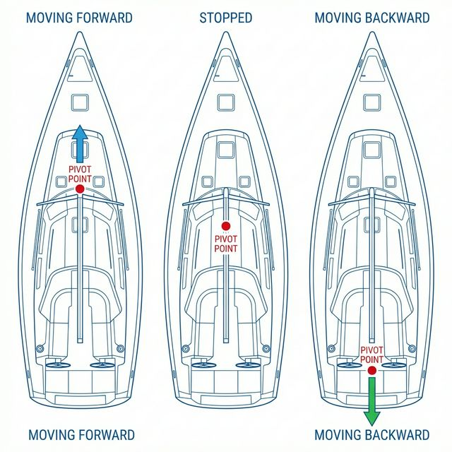
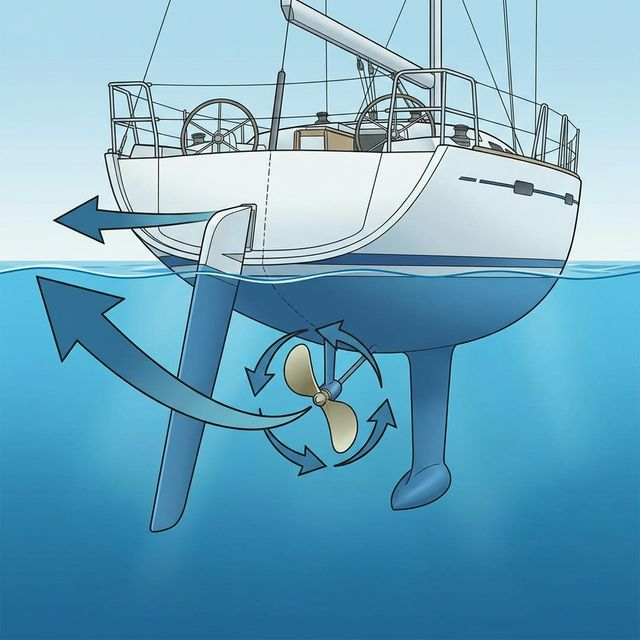
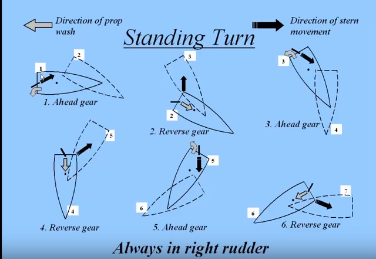

---
title: "요트 접안 기술: 전심(Pivot Point)과 프롭워크를 활용한 1급 해기사의 조종법"
date: 2026-02-16T23:35:00+09:00
description: "1급 해기사가 전하는 요트 접안의 핵심. 전심 원리와 프롭워크, 3포인트 턴 기술 완벽 가이드."
categories: ["Sailing Tips"]
keywords: ["요트 접안", "요트 조종", "마이요트", "제부도요트투어", "전심", "Pivot Point", "프롭워크", "Prop Walk", "1급해기사", "제부도요트", "요트체험"]
draft: false
author: "Captain Lima"
cover:
  image: "pivot-point.png"
  alt: "요트 조종의 핵심 원리: 전심(Pivot Point) 시각화"
  caption: "요트의 회전 중심 전심(Pivot Point)은 속도와 방향에 따라 이동합니다."
---

좁은 마리나에서 요트를 조종하는 것은 베테랑 선장님들에게도 매번 긴장되는 순간입니다. 특히 제 배처럼 **바우쓰러스터(Bow Thruster)가 없는 요트** 는 더욱 그렇습니다. 하지만 배의 물리적인 특성을 정확히 이해한다면, 마치 손발을 움직이듯 요트를 자유자재로 다룰 수 있습니다.

오늘은 요트 조종의 세 가지 핵심 개념인 **전심(Pivot Point)**, **프롭워크(Prop Walk)**, 그리고 **3포인트 턴**을 통해 완벽한 접안을 하는 방법을 알아보겠습니다.

---

## 1. 전심 (Pivot Point): 배는 어디를 중심으로 회전하는가?

자동차는 앞바퀴가 방향을 틀지만, 배는 선미(뒷부분)에 있는 타(Rudder)가 수류를 밀어내며 회전합니다. 이때 배가 회전하는 중심축을 **전심(Pivot Point)** 이라고 합니다.

- **정지 상태**: 보트의 중앙(Centerline) 부근에 위치합니다.
- **전진 시**: 배가 앞으로 나아가면 전심은 **선수(앞부분) 쪽으로 약 1/4~1/3 지점** 으로(주로 마스트 위치) 이동합니다.
- **후진 시**: 배가 뒤로 가면 전심은 **선미(뒷부분) 쪽** 으로 이동합니다.

즉, 자동차와 달리 **선수가 회두하면 선미는 반대방향으로 무조건 회두** 합니다.

> **중요 (IMPORTANT):**
> **왜 중요할까요?**
> 배가 회전할 때 선수보다 선미가 훨씬 크게 바깥으로 흔들린다는 점을 이해해야 합니다. 벽에 붙어서 나갈 때 선미가 벽에 부딪히는 사고가 잦은 이유가 바로 이 전심 때문입니다.

---

## 2. 프롭워크 (Prop Walk): 프로펠러가 배를 옆으로 민다?

프로펠러가 회전하면 배를 앞으로 밀어내기도 하지만, 물의 밀도 차이와 날개 각도 때문에 **선미를 옆으로 밀어내는 힘** 이 발생합니다. 또는 후진 수류가 선미의 우현을 때려서 선미를 좌측으로 이동시킵니다. 이를 **프롭워크(Prop Walk)** 또는 **배수류 측압작용(Discharging Current)** 이라고 합니다.

- **우회전 단추진기 선박 (Right-handed Prop)**: 일반적으로 요트는 후진 기어를 넣었을 때 선미가 **왼쪽(Port side)** 으로 밀리는 경향이 강합니다.
- **활용법**: 이 힘을 역이용하면 좁은 공간에서 배를 옆으로 평행 이동시키거나 급회전할 수 있습니다.

---

## 3. 3포인트 턴 (3-Point Turn): 제자리에서 180도 회전하기

좁은 수로에서 배를 돌려야 할 때, 이 프롭워크를 이용하여 최소한의 반경으로 회전하는 기술입니다.

1. **1단계**: 전진하며 타를 우현으로 끝까지 꺾어 최대한 회전합니다.
2. **2단계**: 타를 그대로 둔 채 후진 기어를 넣고 RPM을 올립니다. 이때 프롭워크가 선미를 왼쪽으로 밀어주는 힘으로 회전이 가속됩니다.
3. **3단계**: 다시 타를 그대로 둔 채 전진 기어를 넣어 회전합니다.

위 동작을 3회 정도 반복하면 최소한의 **선회경(Turning Circle)** 으로 360도 회전할 수 있습니다.

> **팁 (TIP):**
> **주의 사항**: 타를 우현으로 꺾은 상태를 그대로 유지하는 것이 핵심이며, 전/후진을 왕복할 때는 반드시 **'스톱(Neutral)'에서 잠시 멈췄다가 변속** 해야 엔진과 미션에 무리가 가지 않습니다.

---

## 4. 실전 접안 활용: 부드럽게 도킹하기

이 모든 원리를 접안에 적용해 봅시다.

1. **접근**: 예를 들어 우현 후진접안이라면 바람과 조류를 파악하고, 전심을 고려하여 선미가 다 회두하지 않았을때 후진 엔진을 넣어서 우회두를 가속화 합니다.
2. **프롭워크 이용**: 선미 우현이 선착장에 평행이되면 RPM을 줄여 배수류측압 작용을 최소화합니다. 이때 배는 후진을 하고 있어야 합니다.
3. **RPM 조절**: 후진 타효가 있으니 러더와 엔진으로 미세조정을 합니다. 선미를 왼쪽으로 더 돌리고 싶다면 RPM을 순간적으로 올리고, 조절이 필요 없다면 올리지 않습니다. 만약 우현 접안 시 선미가 너무 멀어졌다면, 타를 좌현으로 꺾고 전진 기어를 넣은 뒤 RPM을 올려 선미를 다시 오른쪽으로 돌려줍니다.

---

**Captain Lima의 두마디:**

1. "물 위에는 브레이크가 없습니다. 바람 없는 날 좁은 공간에서 3포인트 턴을 충분히 연습해 보시기 바랍니다. 많은 입문자분들이 RPM은 그대로 둔 채 타(Rudder)만 조작하여 접안을 시도하지만, 바람이나 조류가 불기 시작하면 상황에 맞춰 RPM과 기어를 적극적으로 활용하는 작전이 필요합니다."

2. "측풍이 불면 무조건 선수가 먼저 또 많이 회두합니다. 선수는 가볍고 물에 닿는 면적이 작아 마찰저항이 작기 때문입니다. 반면 선미는 무겁고 물에 닿는 면적이 넓어 마찰저항이 큽니다. 하지만 선수가 회두하면 선미는 반대로 회두하니 이점도 기억하시면 좋습니다."

---

### 📚 함께 읽으면 좋은 글

- **[요트 앵커링(Anchoring): 1급 해기사의 대형선 원리 적용과 실전 팁]()**: 접안만큼 중요한 정박의 기술을 배워보세요.
- **[요트 항해 계획(Passage Planning): 1급 해기사의 A-P-E-M 원칙]()**: 안전한 운항을 위한 체계적인 계획 수립법.
- **[상용 플로터를 넘어서: OpenPlotter와 MacArthur HAT으로 나만의 통합 항해 시스템 만들기]()**: 전심과 항적을 실시간으로 확인하는 항해 시스템 구축기.

**Bon Voyage!**

