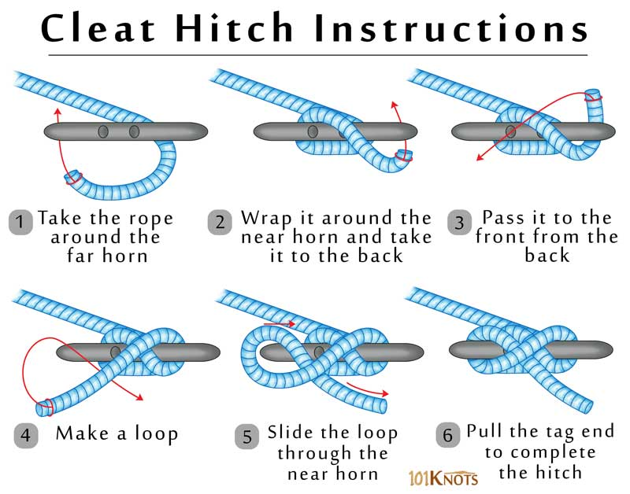
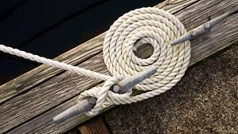

요트를 정박(Mooring)할 때 가장 기본이 되면서도 중요한 것이 바로 **클리트 매듭(Cleat Hitch)**입니다. 단순히 줄을 묶는 것이 아니라, 강한 파도와 바람에도 풀리지 않으면서, 필요할 때는 쉽게 풀 수 있어야 진정한 'Seamanship'이라 할 수 있습니다.

오늘은 많은 분들이 놓치기 쉬운 **매듭의 정석**과 **라인 정리(Coiling)**에 대해 실전 노하우를 공유합니다.

---

## 1. 클리트 매듭(Cleat Hitch)의 정석

많은 세일러들이 실수하는 부분이 바로 첫 번째 턴(Turn)과 마지막 잠금(Locking)입니다. 클리트에 라인을 감을 때, 정확한 각도와 순서를 지켜야만 안전을 담보할 수 있습니다.

*▲ 클리트 매듭의 올바른 순서. 베이스를 감는 각도와 마지막 잠금(Lock)이 핵심입니다.*

### 핵심 포인트: 270도 턴과 응력 분산

저는 항상 교육생들에게 **"라인을 270도로 꺾은 후 위로 올려라"**고 강조합니다. 그 이유는 다음과 같습니다.

1. **270도 턴 (Round Turn)**: 클리트 베이스를 충분히 감아 마찰력을 확보하면서도, 라인끼리 씹히지 않는 최적의 각도가 바로 270도입니다.
    * *180도만 감으면?* 하중이 클리트의 한쪽 뿔(Horn)에만 집중되어 파손 위험이 있습니다.
    * *360도를 다 감으면?* 강한 장력 발생 시 라인이 꽉 끼어(Jam) 풀리지 않을 수 있습니다.
2. **Cross & Lock**: 베이스를 감은 후에는 뿔(Horn) 위로 8자를 그리며 교차시키고, 마지막 고리(Locking Hitch)를 뒤집어 씌워 견고하게 고정합니다.

---

## 2. 주의해야 할 잘못된 예 (Common Mistakes)

초보자들이 흔히 범하는 실수가 있습니다. 바로 라인을 너무 많이 감거나, 엉성하게 묶어두는 것입니다.

*▲ [잘못된 예] 잘 감긴듯 하지만 사실 180도턴입니다. 좌측 포스트에 응력이 집중됩니다.*

매듭은 **'Simple is Best'**입니다. 너무 많이 칭칭 감아두면 오히려 풀기 어렵고 미관상으로도 좋지 않습니다. 교과서적인 8자 감기와 정확한 한 번의 잠금이면 충분합니다.

---

## 3. 마무리: 라인 코일링 (Coiling)

매듭이 끝났다고 라인을 바닥에 널브러뜨려 놓으면 안 됩니다. 남은 라인(Tail)은 깔끔하게 정리해야 진정한 마무리가 됩니다.

*▲ 데크 위에 깔끔하게 정리된 라인 코일링 (Flemish Coil)*

* **Flemish Coil (그림 참조)**: 남은 줄을 소용돌이 모양으로 평평하게 말아두는 방법입니다. 데크 위가 깔끔해지고 줄이 꼬이지 않아 다음 사용 시 편리합니다.
* **Halyard / Cleat Coil**: 클리트 옆에 걸어두거나 매듭 위에 걸어두는 방식도 상황에 따라 유용하게 쓰입니다.

깔끔한 뒷정리는 선장의 품격을 보여줍니다. 본인이나 다른 동료들이 늘어진 라인을 밟고 미끄러지지 않게 배려하는것이 Goodseamanship이라고 할 수 있습니다. 항상 라인을 정리하는 습관을 들이시길 바랍니다.

---

*안전한 항해는 올바른 매듭에서 시작됩니다.*

### 📚 함께 읽으면 좋은 글

* **[요트 앵커링(Anchoring): 1급 해기사의 대형선 원리 적용과 실전 팁]()**: 튼튼한 매듭은 안전한 정박의 시작입니다.
* **[요트 항해 계획(Passage Planning): 1급 해기사의 A-P-E-M 원칙]()**: 출항 준비의 기초, 항해 계획부터 꼼꼼하게 챙겨보세요.

**Bon Voyage!**
